# CSP451 Milestone 3: Enterprise Cloud Solution
## Complete Submission Documentation

**Student ID:** 124166174 
**Course:** CSP451NIA - Cloud Computing  
**Institution:** Seneca College  
**Submission Date:** December 5, 2025  
**Live Application:** http://cloudmart-124166174.canadaeast.azurecontainer.io/

---

## 📋 Table of Contents


1. [Project Overview](#1-project-overview)
2. [Azure Infrastructure Setup](#2-azure-infrastructure-setup)
3. [Cosmos DB Configuration](#3-cosmos-db-configuration)
4. [Application Code](#4-application-code)
5. [Docker Configuration](#5-docker-configuration)
6. [GitHub Actions CI/CD](#6-github-actions-cicd)
7. [Deployment Execution](#7-deployment-execution)
8. [API Testing & Verification](#8-api-testing--verification)
9. [Browser testing/Application screenshots](#9-Browser-testing-and-Application-screenshots)
10. [Azure Portal Screenshots](#10-Azure-Portal-Screenshots)
11. [Github Screenshots](#11-Github-Screenshots)
12. [Dockerhub Screenshots](#12-Dockerhub-Screenshots)
13. [Project Summary](#13-Project-Summary)

## 1. Project Overview

### CloudMart E-Commerce Platform

CloudMart is a production-ready e-commerce platform demonstrating enterprise cloud architecture:

| Feature | Implementation |
|---------|----------------|
| **Architecture** | Multi-tier (Frontend + Backend API + Database) |
| **Container Platform** | Azure Container Instances |
| **Database** | Azure Cosmos DB (NoSQL) |
| **CI/CD** | GitHub Actions → Docker Hub → Azure ACI |
| **Frontend** | HTML5/CSS3/JavaScript SPA |
| **Backend** | Python FastAPI |

### Technology Stack

| Component | Technology                     | Version                |
|----------|---------------------------------|------------------------|
| Runtime  | Python                          | 3.11                   |
| Framework| FastAPI                         | - (pip latest)         |
| Database | Azure Cosmos DB (for NoSQL)     | NoSQL API              |
| Container| Docker                          | -                      |
| CI/CD    | GitHub Actions (checkout v4 etc)| -                      |
| Registry | Docker Hub                      | -                      |
| Cloud    | Microsoft Azure (ACI + CosmosDB)| -                      |


## 2. Azure Infrastructure Setup

### 2.1 Azure Login

```bash
az login

az account list --output json
```

**Output:**
```json
[
  {
    "cloudName": "AzureCloud",
    "homeTenantId": "ed27b597-cea0-4942-8c6f-40e6a78bf47d",
    "id": "71d310bf-1718-4d11-87d1-99a7d4e2053f",
    "isDefault": true,
    "managedByTenants": [],
    "name": "Seneca College : CSP451NIA - 1001",
    "state": "Enabled",
    "tenantDefaultDomain": "senecacollegelabs.onmicrosoft.com",
    "tenantDisplayName": "Seneca College",
    "tenantId": "ed27b597-cea0-4942-8c6f-40e6a78bf47d",
    "user": {
      "name": "odl_user_1886175@seneca-csp451nia.cloudlabs.ai",
      "type": "user"
    }
  }
]
```
### 2.2 Verify Subscription & Resource Group

```bash
az account show --output table
```

**Output:**
```
EnvironmentName    Name                               State    IsDefault
-----------------  ---------------------------------  -------  ----------
AzureCloud         Seneca College : CSP451NIA - 1001  Enabled  True
```

```bash
az group show --name Student-RG-1890084 --output table
```

**Output:**
```
Location    Name
----------  ------------------
canadaeast  Student-RG-1886175
```

### 2.3 Verify Virtual Network

```bash
az network vnet show --name Student-1886175-vnet --resource-group Student-RG-1886175 --output table
```

**Output:**
```
EnableDdosProtection    Location    Name                  PrivateEndpointVNetPolicies    ProvisioningState    ResourceGroup      
----------------------  ----------  --------------------  -----------------------------  -------------------  ------------------
False                   canadaeast  Student-1886175-vnet  Disabled                       Succeeded            Student-RG-1886175
```

### 2.4 Create Network Security Group

```yaml
# Excerpt from .github/workflows/deploy.yml
      - name: Create or update NSG with HTTP/HTTPS/SSH rules
        run: |
          NSG_NAME="${RG_NAME}-nsg"
          # Create NSG if it doesn't exist
          az network nsg create \
            --resource-group "$RG_NAME" \
            --name "$NSG_NAME" \
            --location "$LOCATION" \
            --output none
```

### 2.5 Configure NSG Rules

```yaml
# Excerpt from .github/workflows/deploy.yml
          # AllowHTTP : port 80, priority 100
          az network nsg rule create \
            --resource-group "$RG_NAME" \
            --nsg-name "$NSG_NAME" \
            --name AllowHTTP \
            --priority 100 \
            --direction Inbound \
            --access Allow \
            --protocol Tcp \
            --source-address-prefixes '*' \
            --source-port-ranges '*' \
            --destination-port-ranges 80 \
            --output none
          # AllowHTTPS : port 443, priority 110
          az network nsg rule create \
            --resource-group "$RG_NAME" \
            --nsg-name "$NSG_NAME" \
            --name AllowHTTPS \
            --priority 110 \
            --direction Inbound \
            --access Allow \
            --protocol Tcp \
            --source-address-prefixes '*' \
            --source-port-ranges '*' \
            --destination-port-ranges 443 \
            --output none
          # AllowSSH : port 22, priority 120
          az network nsg rule create \
            --resource-group "$RG_NAME" \
            --nsg-name "$NSG_NAME" \
            --name AllowSSH \
            --priority 120 \
            --direction Inbound \
            --access Allow \
            --protocol Tcp \
            --source-address-prefixes '*' \
            --source-port-ranges '*' \
            --destination-port-ranges 22 \
            --output none
```

**Verify NSG Rules:**
```bash
$ az network nsg rule list --nsg-name Student-RG-1886175-nsg \
  --resource-group Student-RG-1886175 --output table
```

**Output:**
```
Name        ResourceGroup       Priority    SourcePortRanges    SourceAddressPrefixes    SourceASG    Access    Protocol    Direction    DestinationPortRanges    DestinationAddressPrefixes    DestinationASG
----------  ------------------  ----------  ------------------  -----------------------  -----------  --------  ----------  -----------  -----------------------  ----------------------------  ----------------
AllowHTTP   Student-RG-1886175  100         *                   *                        None         Allow     Tcp         Inbound      80                       *                             None
AllowHTTPS  Student-RG-1886175  110         *                   *                        None         Allow     Tcp         Inbound      443                      *                             None
AllowSSH    Student-RG-1886175  120         *                   *                        None         Allow     Tcp         Inbound      22                       *                             None
```

## 3. Cosmos DB Configuration


### 3.1 Create Database and Containers

```bash
# Create SQL database
az cosmosdb sql database create \
  --account-name nnarsa \
  --resource-group Student-RG-1886175 \
  --name cloudmart

# Products container
az cosmosdb sql container create \
  --account-name nnarsa \
  --resource-group Student-RG-1886175 \
  --database-name cloudmart \
  --name product \
  --partition-key-path "/category"

# Cart container
az cosmosdb sql container create \
  --account-name nnarsa \
  --resource-group Student-RG-1886175 \
  --database-name cloudmart \
  --name cart \
  --partition-key-path "/user_id"

# Orders container
az cosmosdb sql container create \
  --account-name nnarsa \
  --resource-group Student-RG-1886175 \
  --database-name cloudmart \
  --name orders \
  --partition-key-path "/user_id"

```

**Verification:**
```bash
az cosmosdb sql container list \
 --account-name nnarsa \
 --resource-group Student-RG-1886175 \
 --database-name cloudmart \
 --query "[].{Name:name, PartitionKey:resource.partitionKey.paths[0]}" \
 --output table
```

**Output:**
```
Name     PartitionKey
-------  --------------
cart     /user_id
product  /category
orders   /user_id
```


### 3.2 Get Cosmos DB Connection Details
```bash
az cosmosdb keys list --name nnarsa --resource-group Student-RG-1886175 --query primaryMasterKey -o tsv

echo "Endpoint: https://nnarsa.documents.azure.com:443/"
```

## 4. Application Code

### 4.1 Application frontend (applications/frontend/nginx.conf)
```html
server {
    listen 80;
    server_name _;

    # Serve static files
    root /usr/share/nginx/html;
    index index.html;


    location / {
        try_files $uri $uri/ /index.html;
    }
}
```

### 4.2 Application frontend (applications/frontend/src/app.js)
```js
// old (for dev)
//const API_BASE = "http://localhost:8000";

const API_BASE = window.location.origin;

const productsDiv = document.getElementById("products");
const cartDiv = document.getElementById("cart");
const cartTotalSpan = document.getElementById("cartTotal");
const categorySelect = document.getElementById("categorySelect");
const filterBtn = document.getElementById("filterBtn");
const placeOrderBtn = document.getElementById("placeOrderBtn");
const orderMessageDiv = document.getElementById("orderMessage")

// cache products to look up name/price for cart
let productsById = {};

async function fetchJSON(url, options = {}) {
  const res = await fetch(url, options);
  if (!res.ok) throw new Error(`Request failed: ${res.status}`);
  return await res.json();
}

async function loadCategories() {
  const categories = await fetchJSON(`${API_BASE}/api/v1/categories`);
  categories.forEach(cat => {
    const opt = document.createElement("option");
    opt.value = cat;
    opt.textContent = cat;
    categorySelect.appendChild(opt);
  });
}

async function loadProducts(category = "") {
  const products = await fetchJSON(`${API_BASE}/api/v1/products`);

  // refresh the global map of ALL products
  allProductsById = {};
  products.forEach(p => {
    allProductsById[p.id] = p;
  });

  const toShow = category
    ? products.filter(p => p.category === category)
    : products;

  productsDiv.innerHTML = "";
  
  toShow.forEach(p => {
    const div = document.createElement("div");
    div.className = "product";
    div.innerHTML = `
      <strong>${p.name}</strong><br/>
      Category: ${p.category}<br/>
      Price: $${p.price.toFixed(2)}<br/>
      <button data-id="${p.id}">Add to Cart</button>
    `;
    const btn = div.querySelector("button");
    btn.addEventListener("click", () => addToCart(p.id));
    productsDiv.appendChild(div);
  });
}

async function loadCart() {
  const items = await fetchJSON(`${API_BASE}/api/v1/cart`);
  cartDiv.innerHTML = "";
  let total = 0;

  items.forEach(item => {
    const product = allProductsById[item.product_id];
    const price = product ? product.price : 0;
    const lineTotal = price * item.quantity;
    total += lineTotal;

    const div = document.createElement("div");
    div.className = "cart-item";
    div.innerHTML = `
      Product: ${product ? product.name : item.product_id}<br/>
      Quantity: ${item.quantity}<br/>
      Unit Price: $${price.toFixed(2)}<br/>
      Line Total: $${lineTotal.toFixed(2)}<br/>
      <button data-id="${item.id}">Remove</button>
    `;

    const removeBtn = div.querySelector("button");
    removeBtn.addEventListener("click", () => removeFromCart(item.id));

    cartDiv.appendChild(div);
  });

  cartTotalSpan.textContent = total.toFixed(2);
}


async function addToCart(productId) {
  const quantity = 1; 

  const payload = {
    id: `cart-${Date.now()}`,
    user_id: "demo",
    product_id: productId,
    quantity: quantity
  };

  await fetchJSON(`${API_BASE}/api/v1/cart/items`, {
    method: "POST",
    headers: { "Content-Type": "application/json" },
    body: JSON.stringify(payload)
  });

  await loadCart();
}

async function removeFromCart(itemId) {
  try {
    await fetch(`${API_BASE}/api/v1/cart/items/${encodeURIComponent(itemId)}`, {
      method: "DELETE"
    });
    await loadCart();
  } catch (err) {
    console.error("Remove error:", err);
  }
}


async function placeOrder() {
  orderMessageDiv.textContent = "";

  // 1) Get cart items from API
  const items = await fetchJSON(`${API_BASE}/api/v1/cart`);

  if (!items.length) {
    orderMessageDiv.textContent = "Cart is empty. Add some products first.";
    return;
  }

  // 2) Build order payload
  const payload = {
    id: `order-${Date.now()}`,
    user_id: "demo",
    items: items,
    status: "confirmed"
  };

  let order;
  try {
    order = await fetchJSON(`${API_BASE}/api/v1/orders`, {
      method: "POST",
      headers: { "Content-Type": "application/json" },
      body: JSON.stringify(payload)
    });
  } catch (err) {
    console.error("Order error:", err);
    orderMessageDiv.textContent = "Error placing order.";
    return;
  }
  await loadCart();
  console.log("Order response from API:", order);

  // 3) Decide what total to show
  let total = order.total;

  // Fallback: compute from cart if backend didn't send total
  if (total === undefined || total === null) {
    total = 0;
    items.forEach(item => {
      const product = allProductsById[item.product_id];
      const price = product ? product.price : 0;
      total += price * item.quantity;
    });
  }

  orderMessageDiv.innerHTML = `
    <strong>Order placed!</strong><br/>
    Order ID: ${order.id}<br/>
    Status: ${order.status}<br/>
    Total: $${total.toFixed(2)}
  `;
}


// Wire up events
filterBtn.addEventListener("click", () => {
  const cat = categorySelect.value;
  loadProducts(cat).then(loadCart);
});

placeOrderBtn.addEventListener("click", () => {
  placeOrder().catch(err => {
    console.error(err);
    orderMessageDiv.textContent = "Error placing order.";
  });
});

// Initial load
(async function init() {
  try {
    await loadCategories();
    await loadProducts();
  } catch (err) {
    console.error("Init error:", err);
  }
})();
```
### 4.3 Application frontend (applications/frontend/src/index.html)
```html
  <meta charset="UTF-8" />
  <title>Cloudmart</title>
  <style>
    body { font-family: Arial, sans-serif; margin: 20px; }
    h1, h2 { margin-bottom: 0.5rem; }
    .row { display: flex; gap: 2rem; align-items: flex-start; }
    .column { flex: 1; }
    .product, .cart-item, .order-msg { border: 1px solid #ccc; padding: 8px; margin-bottom: 8px; }
    button { cursor: pointer; }
  </style>
</head>
<body>
  <h1>Cloudmart Products</h1>

  <div>
    <label for="categorySelect">Filter by category:</label>
    <select id="categorySelect">
      <option value="">All</option>
    </select>
    <button id="filterBtn">Apply Filter</button>
  </div>

  <div class="row">
    <div class="column">
      <h2>Products</h2>
      <div id="products"></div>
    </div>

    <div class="column">
      <h2>Shopping Cart</h2>
      <div id="cart"></div>
      <p><strong>Total:</strong> $<span id="cartTotal">0.00</span></p>
      <button id="placeOrderBtn">Place Order</button>
      <div id="orderMessage" class="order-msg"></div>
    </div>
  </div>

  <script src="/static/app.js"></script>
</body>
</html>
```

### 4.4 Application frontend (applications/backend/app/database.py)
```py
import os
from dotenv import load_dotenv
from typing import List, Optional
from uuid import uuid4
from azure.cosmos import CosmosClient, PartitionKey, exceptions

load_dotenv()

COSMOS_ENDPOINT = os.getenv("COSMOS_ENDPOINT")
COSMOS_KEY = os.getenv("COSMOS_KEY")
COSMOS_DB_NAME = "cloudmart"

#if not COSMOS_ENDPOINT or not COSMOS_KEY:
#    raise RuntimeError("COSMOS_ENDPOINT and COSMOS_KEY must be set as env vars")

client = CosmosClient(COSMOS_ENDPOINT, COSMOS_KEY)
db = client.get_database_client(COSMOS_DB_NAME)

product_container = db.get_container_client("product")
cart_container = db.get_container_client("cart")
orders_container = db.get_container_client("orders")

# ---------- Product helpers ----------

def get_all_products(category: Optional[str] = None) -> List[dict]:
    if category:
        query = "SELECT * FROM c WHERE c.category = @cat"
        params = [{"name": "@cat", "value": category}]
        items = list(product_container.query_items(
            query=query,
            parameters=params,
            enable_cross_partition_query=True
        ))
    else:
        items = list(product_container.read_all_items())
    return items

def get_product_by_id(product_id: str) -> Optional[dict]:
    query = "SELECT * FROM c WHERE c.id = @id"
    params = [{"name": "@id", "value": product_id}]
    items = list(product_container.query_items(
        query=query,
        parameters=params,
        enable_cross_partition_query=True
    ))
    return items[0] if items else None

def get_categories() -> List[str]:
    query = "SELECT DISTINCT c.category FROM c"
    items = list(product_container.query_items(
        query=query,
        enable_cross_partition_query=True
    ))
    return [i["category"] for i in items]


def get_product_by_id(product_id: str) -> Optional[dict]:
    query = "SELECT * FROM c WHERE c.id = @id"
    params = [{"name": "@id", "value": product_id}]
    items = list(product_container.query_items(
        query=query,
        parameters=params,
        enable_cross_partition_query=True,
    ))
    return items[0] if items else None


def get_product_price(product_id: str) -> float:
    query = "SELECT c.price FROM c WHERE c.id = @id"
    params = [{"name": "@id", "value": product_id}]
    results = list(product_container.query_items(
        query=query,
        parameters=params,
        enable_cross_partition_query=True
    ))
    if not results:
        raise ValueError(f"Product {product_id} not found")
    return results[0]["price"]

# ---------- Cart helpers ----------

def get_cart_items(user_id: str) -> List[dict]:
    query = "SELECT * FROM c WHERE c.user_id = @uid"
    params = [{"name": "@uid", "value": user_id}]
    items = list(cart_container.query_items(
        query=query,
        parameters=params,
        enable_cross_partition_query=True
    ))
    return items

def add_cart_item(item: dict) -> dict:
    # item must have user_id as partition key
    created = cart_container.create_item(body=item)
    return created

def add_or_increment_cart_item(user_id: str, product_id: str, quantity: int = 1) -> dict:
    # Check if this user already has this product in their cart
    query = "SELECT * FROM c WHERE c.user_id = @uid AND c.product_id = @pid"
    params = [
        {"name": "@uid", "value": user_id},
        {"name": "@pid", "value": product_id},
    ]
    existing = list(cart_container.query_items(
        query=query,
        parameters=params,
        enable_cross_partition_query=True,
    ))

    if existing:
        doc = existing[0]
        doc["quantity"] = doc.get("quantity", 0) + quantity
        cart_container.replace_item(doc, doc)
        return doc
    else:
        new_item = {
            "id": str(uuid4()),
            "user_id": user_id,
            "product_id": product_id,
            "quantity": quantity,
        }
        cart_container.create_item(body=new_item)
        return new_item

def delete_cart_item(item_id: str, user_id: str) -> bool:
    try:
        cart_container.delete_item(item=item_id, partition_key=user_id)
        return True
    except exceptions.CosmosResourceNotFoundError:
        return False

# ---------- Order helpers ----------

def clear_cart_for_user(user_id: str) -> None:
    query = "SELECT c.id FROM c WHERE c.user_id = @uid"
    params = [{"name": "@uid", "value": user_id}]

    items = cart_container.query_items(
        query=query,
        parameters=params,
        enable_cross_partition_query=True,
    )

    for item in items:
        cart_container.delete_item(item["id"], partition_key=user_id)

def create_order(order: dict) -> dict:
    return orders_container.create_item(body=order)

def get_orders(user_id: str) -> List[dict]:
    query = "SELECT * FROM c WHERE c.user_id = @uid"
    params = [{"name": "@uid", "value": user_id}]
    items = list(orders_container.query_items(
        query=query,
        parameters=params,
        enable_cross_partition_query=True
    ))
    return items
```

### 4.5 Application frontend (applications/backend/app/main.py)
```py
from fastapi import FastAPI, HTTPException, Query
from fastapi.staticfiles import StaticFiles
from fastapi.middleware.cors import CORSMiddleware
from fastapi.responses import HTMLResponse, FileResponse
from pydantic import BaseModel
from typing import List, Optional
from . import database as db

app = FastAPI()
app.mount("/static", StaticFiles(directory="static", html=True), name="static")

# Allow frontend to call the API

app.add_middleware(
    CORSMiddleware,
    allow_origins=["*"], 
    allow_credentials=True,
    allow_methods=["*"],
    allow_headers=["*"],
)


# ---------- Models ----------

class CartItem(BaseModel):
    id: str
    user_id: str
    product_id: str
    quantity: int

class Order(BaseModel):
    id: str
    user_id: str
    items: List[CartItem]
    status: str
    total: Optional[float] = None

class Product(BaseModel):
    id: str
    name: str
    category: str
    price: float

class CartItem(BaseModel):
    id: str
    user_id: str
    product_id: str
    quantity: int

class Order(BaseModel):
    id: str
    user_id: str
    items: List[CartItem]
    status: str

# ---------- HTML homepage ----------

@app.get("/", response_class=HTMLResponse)
async def read_root():
    return FileResponse("static/index.html")


# ---------- /health ----------

@app.get("/health")
def health():
    # simple check: try reading 1 product; if it fails, error
    try:
        products = db.get_all_products()
        return {"status": "ok", "product_count": len(products)}
    except Exception as e:
        return {"status": "error", "detail": str(e)}

# ---------- Products ----------

@app.get("/api/v1/products", response_model=List[Product])
def list_products(category: Optional[str] = Query(default=None, alias="category")):
    """
    GET /api/v1/products
    GET /api/v1/products?category={cat}
    """
    items = db.get_all_products(category=category)
    return items

@app.get("/api/v1/products/{id}", response_model=Product)
def get_product(id: str):
    item = db.get_product_by_id(id)
    if not item:
        raise HTTPException(status_code=404, detail="Product not found")
    return item

@app.get("/api/v1/categories", response_model=List[str])
def list_categories():
    return db.get_categories()

# ---------- Cart ----------

@app.get("/api/v1/cart")
async def get_cart(user_id: str = "demo"):
    return db.get_cart_items(user_id)

@app.post("/api/v1/cart/items", response_model=CartItem)
async def add_cart_item(item: CartItem):
    updated = db.add_or_increment_cart_item(
        user_id=item.user_id,
        product_id=item.product_id,
        quantity=item.quantity or 1,
    )
    return updated

@app.delete("/api/v1/cart/items/{id}")
def remove_cart_item(id: str, user_id: str = "demo"):
    ok = db.delete_cart_item(item_id=id, user_id=user_id)
    if not ok:
        raise HTTPException(status_code=404, detail="Cart item not found")
    return {"status": "deleted"}

@app.delete("/api/v1/cart/items/{item_id}")
async def delete_cart_item_endpoint(item_id: str, user_id: str = "demo"):
    ok = db.delete_cart_item(item_id, user_id)
    if not ok:
        raise HTTPException(status_code=404, detail="Cart item not found")
    return {"status": "deleted"}


@app.delete("/api/v1/cart/items/{item_id}")
async def delete_cart_item(item_id: str, user_id: str = "demo"):
    try:
        db.delete_cart_item(item_id, user_id)
    except Exception:
        raise HTTPException(status_code=404, detail="Cart item not found")
    return {"status": "deleted"}
# ---------- Orders ----------

@app.post("/api/v1/orders", response_model=Order)
async def create_order(order: Order):
    # calculate total from products in Cosmos
    total = 0.0
    for item in order.items:
        product = db.get_product_by_id(item.product_id)
        if not product:
            raise HTTPException(status_code=404, detail=f"Product {item.product_id} not found")
        price = product["price"]
        total += price * item.quantity

    order_dict = order.dict()
    order_dict["total"] = total

    created = db.create_order(order_dict)
    db.clear_cart_for_user(order.user_id)
    return created
    
@app.get("/api/v1/orders", response_model=List[Order])
def list_orders(user_id: str = "demo"):
    items = db.get_orders(user_id=user_id)
    return items
```

## 5. Docker Configuration

### 5.1 Dockerfile
```dockerfile
# Production Dockerfile for Cloudmart (API + frontend)
FROM python:3.11-slim AS builder

ENV PYTHONDONTWRITEBYTECODE=1
ENV PYTHONUNBUFFERED=1

WORKDIR /build

# Install backend dependencies
COPY applications/backend/requirements.txt .
RUN pip install --no-cache-dir -r requirements.txt

# Copy backend FastAPI app
COPY applications/backend/app ./app

# Copy frontend files
COPY applications/frontend/src ./static

# Runtime Stage

FROM python:3.11-slim AS runtime

ENV PYTHONDONTWRITEBYTECODE=1
ENV PYTHONUNBUFFERED=1

WORKDIR /app

COPY applications/backend/requirements.txt .
RUN pip install --no-cache-dir -r requirements.txt

COPY --from=builder /build/app ./app
COPY --from=builder /build/static ./static

ENV PORT=80
EXPOSE 80


CMD ["uvicorn", "app.main:app", "--host", "0.0.0.0", "--port", "80"]
```

### 5.2 Build and Push to Docker Hub
```yaml
# Excerpt from .github/workflows/deploy.yml
      - name: Log in to Docker Hub
        run: |
          echo "${{ secrets.DOCKERHUB_TOKEN }}" \
            | docker login -u "${{ secrets.DOCKERHUB_USERNAME }}" --password-stdin

      - name: Build production image
        run: |
          docker build -f Dockerfile -t "$IMAGE_NAME" .

      - name: Push image to Docker Hub
        run: |
          docker push "$IMAGE_NAME"
```

## 6. GitHub Actions CI/CD

### 6.1 ci.yml (CI)
```yaml
name: CI - Backend - Frontend

on:
  push:
    branches:
      - cloudmart
  pull_request:
    branches:
      - cloudmart

jobs:
  backend-check:
    runs-on: ubuntu-latest

    steps:
      - name: Checkout repo
        uses: actions/checkout@v4

      - name: Set up Python
        uses: actions/setup-python@v5
        with:
          python-version: '3.11'

      - name: Install backend dependencies
        working-directory: applications/backend
        run: |
          python -m pip install --upgrade pip
          pip install -r requirements.txt
      - name: "Sanity check: backend imports"
        working-directory: applications/backend
        run: |
          python -m py_compile app/main.py app/database.py
  frontend-check:
    runs-on: ubuntu-latest

    steps:
      - name: Checkout repo
        uses: actions/checkout@v4

      - name: Set up Node
        uses: actions/setup-node@v4
        with:
          node-version: '20'

      - name: "Sanity check: frontend JS syntax"
        working-directory: applications/frontend
        run: |
          node --check src/app.js
      - name: "Sanity check: index.html exists"
        working-directory: applications/frontend
        run: |
          test -f src/index.html

```

### 6.2 deply.yml (CD)
```yaml
name: CD - Cloudmart Production

on:
  workflow_run:
    workflows: ["CI - Backend - Frontend"]
    types: [completed]

jobs:
  deploy:
    if: ${{ github.event.workflow_run.conclusion == 'success' }}
    runs-on: ubuntu-latest

    env:
      IMAGE_NAME: ${{ secrets.DOCKERHUB_USERNAME }}/cloudmart:production
      RG_NAME: Student-RG-1886175        
      LOCATION: canadaeast           
      ACI_NAME: cloudmart-prod
      DNS_LABEL: cloudmart-124166174

    steps:
      - name: Checkout repo
        uses: actions/checkout@v4


      - name: Log in to Docker Hub
        run: |
          echo "${{ secrets.DOCKERHUB_TOKEN }}" \
            | docker login -u "${{ secrets.DOCKERHUB_USERNAME }}" --password-stdin
      - name: Build production image
        run: |
          docker build -f Dockerfile -t "$IMAGE_NAME" .
      - name: Push image to Docker Hub
        run: |
          docker push "$IMAGE_NAME"
      - name: Parse Azure credentials
        run: |
          echo '${{ secrets.AZURE_CREDENTIALS }}' > azure-creds.json
          echo "AZURE_CLIENT_ID=$(jq -r .clientId azure-creds.json)" >> $GITHUB_ENV
          echo "AZURE_CLIENT_SECRET=$(jq -r .clientSecret azure-creds.json)" >> $GITHUB_ENV
          echo "AZURE_TENANT_ID=$(jq -r .tenantId azure-creds.json)" >> $GITHUB_ENV
          echo "AZURE_SUBSCRIPTION_ID=$(jq -r .subscriptionId azure-creds.json)" >> $GITHUB_ENV
      - name: Azure CLI login
        run: |
          az login --service-principal \
            --username "$AZURE_CLIENT_ID" \
            --password "$AZURE_CLIENT_SECRET" \
            --tenant "$AZURE_TENANT_ID"
          az account set --subscription "$AZURE_SUBSCRIPTION_ID"
      - name: Ensure resource group exists
        run: |
          az group create -n "$RG_NAME" -l "$LOCATION"
      - name: Create or update NSG with HTTP/HTTPS/SSH rules
        run: |
          NSG_NAME="${RG_NAME}-nsg"
          # Create NSG if it doesn't exist
          az network nsg create \
            --resource-group "$RG_NAME" \
            --name "$NSG_NAME" \
            --location "$LOCATION" \
            --output none
          # AllowHTTP : port 80, priority 100
          az network nsg rule create \
            --resource-group "$RG_NAME" \
            --nsg-name "$NSG_NAME" \
            --name AllowHTTP \
            --priority 100 \
            --direction Inbound \
            --access Allow \
            --protocol Tcp \
            --source-address-prefixes '*' \
            --source-port-ranges '*' \
            --destination-port-ranges 80 \
            --output none
          # AllowHTTPS : port 443, priority 110
          az network nsg rule create \
            --resource-group "$RG_NAME" \
            --nsg-name "$NSG_NAME" \
            --name AllowHTTPS \
            --priority 110 \
            --direction Inbound \
            --access Allow \
            --protocol Tcp \
            --source-address-prefixes '*' \
            --source-port-ranges '*' \
            --destination-port-ranges 443 \
            --output none
          # AllowSSH : port 22, priority 120
          az network nsg rule create \
            --resource-group "$RG_NAME" \
            --nsg-name "$NSG_NAME" \
            --name AllowSSH \
            --priority 120 \
            --direction Inbound \
            --access Allow \
            --protocol Tcp \
            --source-address-prefixes '*' \
            --source-port-ranges '*' \
            --destination-port-ranges 22 \
            --output none
      - name: Deploy Azure Container Instance
        env:
          COSMOS_ENDPOINT: ${{ secrets.COSMOS_ENDPOINT }}
          COSMOS_KEY: ${{ secrets.COSMOS_KEY }}
          COSMOS_DB_NAME: cloudmart
        run: |
          # If an instance with this name already exists, delete it first
          if az container show -g "$RG_NAME" -n "$ACI_NAME" --only-show-errors &>/dev/null; then
            az container delete -g "$RG_NAME" -n "$ACI_NAME" --yes --only-show-errors
          fi
          az container create \
            --resource-group "$RG_NAME" \
            --name "$ACI_NAME" \
            --image "$IMAGE_NAME" \
            --cpu 1 \
            --memory 1.5 \
            --ports 80 \
            --ip-address Public \
            --dns-name-label "$DNS_LABEL" \
            --restart-policy Always \
            --os-type Linux \
            --environment-variables "COSMOS_DB_NAME=${COSMOS_DB_NAME}" \
            --secure-environment-variables \
              COSMOS_ENDPOINT="$COSMOS_ENDPOINT" \
              COSMOS_KEY="$COSMOS_KEY" \
            --command-line "uvicorn app.main:app --host 0.0.0.0 --port 80"
      - name: Show public URL
        run: |
          echo "Cloudmart is deploying at:"
          echo "  http://${DNS_LABEL}.${LOCATION}.azurecontainer.io"
```
### 6.3 ci.yml (CI) frontend logs
```
2025-12-03T12:29:08.7731047Z Current runner version: '2.329.0'
2025-12-03T12:29:08.7755544Z ##[group]Runner Image Provisioner
2025-12-03T12:29:08.7756417Z Hosted Compute Agent
2025-12-03T12:29:08.7756957Z Version: 20251016.436
2025-12-03T12:29:08.7757573Z Commit: 8ab8ac8bfd662a3739dab9fe09456aba92132568
2025-12-03T12:29:08.7758223Z Build Date: 2025-10-15T20:44:12Z
2025-12-03T12:29:08.7758893Z ##[endgroup]
2025-12-03T12:29:08.7759457Z ##[group]Operating System
2025-12-03T12:29:08.7759964Z Ubuntu
2025-12-03T12:29:08.7760567Z 24.04.3
2025-12-03T12:29:08.7761012Z LTS
2025-12-03T12:29:08.7761468Z ##[endgroup]
2025-12-03T12:29:08.7762016Z ##[group]Runner Image
2025-12-03T12:29:08.7762781Z Image: ubuntu-24.04
2025-12-03T12:29:08.7763379Z Version: 20251112.124.1
2025-12-03T12:29:08.7764465Z Included Software: https://github.com/actions/runner-images/blob/ubuntu24/20251112.124/images/ubuntu/Ubuntu2404-Readme.md
2025-12-03T12:29:08.7765988Z Image Release: https://github.com/actions/runner-images/releases/tag/ubuntu24%2F20251112.124
2025-12-03T12:29:08.7767029Z ##[endgroup]
2025-12-03T12:29:08.7768144Z ##[group]GITHUB_TOKEN Permissions
2025-12-03T12:29:08.7770261Z Contents: read
2025-12-03T12:29:08.7770831Z Metadata: read
2025-12-03T12:29:08.7771341Z Packages: read
2025-12-03T12:29:08.7771843Z ##[endgroup]
2025-12-03T12:29:08.7774181Z Secret source: Actions
2025-12-03T12:29:08.7775121Z Prepare workflow directory
2025-12-03T12:29:08.8097763Z Prepare all required actions
2025-12-03T12:29:08.8136179Z Getting action download info
2025-12-03T12:29:09.1745047Z Download action repository 'actions/checkout@v4' (SHA:34e114876b0b11c390a56381ad16ebd13914f8d5)
2025-12-03T12:29:09.6756876Z Download action repository 'actions/setup-node@v4' (SHA:49933ea5288caeca8642d1e84afbd3f7d6820020)
2025-12-03T12:29:09.9271654Z Complete job name: frontend-check
2025-12-03T12:29:09.9937018Z ##[group]Run actions/checkout@v4
2025-12-03T12:29:09.9937865Z with:
2025-12-03T12:29:09.9938402Z   repository: KnackNarsa/CSP451_Final_Project_124166174_Narsa
2025-12-03T12:29:09.9939193Z   token: ***
2025-12-03T12:29:09.9939619Z   ssh-strict: true
2025-12-03T12:29:09.9940047Z   ssh-user: git
2025-12-03T12:29:09.9940470Z   persist-credentials: true
2025-12-03T12:29:09.9940943Z   clean: true
2025-12-03T12:29:09.9941391Z   sparse-checkout-cone-mode: true
2025-12-03T12:29:09.9941932Z   fetch-depth: 1
2025-12-03T12:29:09.9942385Z   fetch-tags: false
2025-12-03T12:29:09.9943013Z   show-progress: true
2025-12-03T12:29:09.9943485Z   lfs: false
2025-12-03T12:29:09.9943914Z   submodules: false
2025-12-03T12:29:09.9944346Z   set-safe-directory: true
2025-12-03T12:29:09.9945037Z ##[endgroup]
2025-12-03T12:29:10.1117744Z Syncing repository: KnackNarsa/CSP451_Final_Project_124166174_Narsa
2025-12-03T12:29:10.1119627Z ##[group]Getting Git version info
2025-12-03T12:29:10.1120707Z Working directory is '/home/runner/work/CSP451_Final_Project_124166174_Narsa/CSP451_Final_Project_124166174_Narsa'
2025-12-03T12:29:10.1121970Z [command]/usr/bin/git version
2025-12-03T12:29:10.3730030Z git version 2.51.2
2025-12-03T12:29:10.3757648Z ##[endgroup]
2025-12-03T12:29:10.3774576Z Temporarily overriding HOME='/home/runner/work/_temp/b3386182-c13c-4afc-9146-b6839c5fc811' before making global git config changes
2025-12-03T12:29:10.3777298Z Adding repository directory to the temporary git global config as a safe directory
2025-12-03T12:29:10.3789727Z [command]/usr/bin/git config --global --add safe.directory /home/runner/work/CSP451_Final_Project_124166174_Narsa/CSP451_Final_Project_124166174_Narsa
2025-12-03T12:29:10.3828526Z Deleting the contents of '/home/runner/work/CSP451_Final_Project_124166174_Narsa/CSP451_Final_Project_124166174_Narsa'
2025-12-03T12:29:10.3831573Z ##[group]Initializing the repository
2025-12-03T12:29:10.3837708Z [command]/usr/bin/git init /home/runner/work/CSP451_Final_Project_124166174_Narsa/CSP451_Final_Project_124166174_Narsa
2025-12-03T12:29:10.3949196Z hint: Using 'master' as the name for the initial branch. This default branch name
2025-12-03T12:29:10.3950486Z hint: is subject to change. To configure the initial branch name to use in all
2025-12-03T12:29:10.3951869Z hint: of your new repositories, which will suppress this warning, call:
2025-12-03T12:29:10.3953267Z hint:
2025-12-03T12:29:10.3954216Z hint: 	git config --global init.defaultBranch <name>
2025-12-03T12:29:10.3955354Z hint:
2025-12-03T12:29:10.3956402Z hint: Names commonly chosen instead of 'master' are 'main', 'trunk' and
2025-12-03T12:29:10.3957720Z hint: 'development'. The just-created branch can be renamed via this command:
2025-12-03T12:29:10.3958673Z hint:
2025-12-03T12:29:10.3959346Z hint: 	git branch -m <name>
2025-12-03T12:29:10.3959860Z hint:
2025-12-03T12:29:10.3960489Z hint: Disable this message with "git config set advice.defaultBranchName false"
2025-12-03T12:29:10.3961921Z Initialized empty Git repository in /home/runner/work/CSP451_Final_Project_124166174_Narsa/CSP451_Final_Project_124166174_Narsa/.git/
2025-12-03T12:29:10.3965524Z [command]/usr/bin/git remote add origin https://github.com/KnackNarsa/CSP451_Final_Project_124166174_Narsa
2025-12-03T12:29:10.4001510Z ##[endgroup]
2025-12-03T12:29:10.4002952Z ##[group]Disabling automatic garbage collection
2025-12-03T12:29:10.4005249Z [command]/usr/bin/git config --local gc.auto 0
2025-12-03T12:29:10.4033065Z ##[endgroup]
2025-12-03T12:29:10.4034237Z ##[group]Setting up auth
2025-12-03T12:29:10.4039257Z [command]/usr/bin/git config --local --name-only --get-regexp core\.sshCommand
2025-12-03T12:29:10.4068348Z [command]/usr/bin/git submodule foreach --recursive sh -c "git config --local --name-only --get-regexp 'core\.sshCommand' && git config --local --unset-all 'core.sshCommand' || :"
2025-12-03T12:29:10.4404153Z [command]/usr/bin/git config --local --name-only --get-regexp http\.https\:\/\/github\.com\/\.extraheader
2025-12-03T12:29:10.4433102Z [command]/usr/bin/git submodule foreach --recursive sh -c "git config --local --name-only --get-regexp 'http\.https\:\/\/github\.com\/\.extraheader' && git config --local --unset-all 'http.https://github.com/.extraheader' || :"
2025-12-03T12:29:10.4649006Z [command]/usr/bin/git config --local --name-only --get-regexp ^includeIf\.gitdir:
2025-12-03T12:29:10.4679019Z [command]/usr/bin/git submodule foreach --recursive git config --local --show-origin --name-only --get-regexp remote.origin.url
2025-12-03T12:29:10.4910299Z [command]/usr/bin/git config --local http.https://github.com/.extraheader AUTHORIZATION: basic ***
2025-12-03T12:29:10.4943294Z ##[endgroup]
2025-12-03T12:29:10.4951276Z ##[group]Fetching the repository
2025-12-03T12:29:10.4954161Z [command]/usr/bin/git -c protocol.version=2 fetch --no-tags --prune --no-recurse-submodules --depth=1 origin +0dadcf190755cc86b4635f6f14459412dd373961:refs/remotes/origin/cloudmart
2025-12-03T12:29:10.7541050Z From https://github.com/KnackNarsa/CSP451_Final_Project_124166174_Narsa
2025-12-03T12:29:10.7544069Z  * [new ref]         0dadcf190755cc86b4635f6f14459412dd373961 -> origin/cloudmart
2025-12-03T12:29:10.7574684Z ##[endgroup]
2025-12-03T12:29:10.7575847Z ##[group]Determining the checkout info
2025-12-03T12:29:10.7577440Z ##[endgroup]
2025-12-03T12:29:10.7581309Z [command]/usr/bin/git sparse-checkout disable
2025-12-03T12:29:10.7620021Z [command]/usr/bin/git config --local --unset-all extensions.worktreeConfig
2025-12-03T12:29:10.7645162Z ##[group]Checking out the ref
2025-12-03T12:29:10.7648370Z [command]/usr/bin/git checkout --progress --force -B cloudmart refs/remotes/origin/cloudmart
2025-12-03T12:29:10.7699497Z Switched to a new branch 'cloudmart'
2025-12-03T12:29:10.7702457Z branch 'cloudmart' set up to track 'origin/cloudmart'.
2025-12-03T12:29:10.7708859Z ##[endgroup]
2025-12-03T12:29:10.7740992Z [command]/usr/bin/git log -1 --format=%H
2025-12-03T12:29:10.7763502Z 0dadcf190755cc86b4635f6f14459412dd373961
2025-12-03T12:29:10.8093718Z ##[group]Run actions/setup-node@v4
2025-12-03T12:29:10.8094940Z with:
2025-12-03T12:29:10.8095769Z   node-version: 20
2025-12-03T12:29:10.8096694Z   always-auth: false
2025-12-03T12:29:10.8097642Z   check-latest: false
2025-12-03T12:29:10.8098871Z   token: ***
2025-12-03T12:29:10.8099979Z ##[endgroup]
2025-12-03T12:29:10.9887131Z Found in cache @ /opt/hostedtoolcache/node/20.19.5/x64
2025-12-03T12:29:10.9893893Z ##[group]Environment details
2025-12-03T12:29:13.2805212Z node: v20.19.5
2025-12-03T12:29:13.2805627Z npm: 10.8.2
2025-12-03T12:29:13.2806867Z yarn: 1.22.22
2025-12-03T12:29:13.2808083Z ##[endgroup]
2025-12-03T12:29:13.2921621Z ##[group]Run node --check src/app.js
2025-12-03T12:29:13.2921987Z node --check src/app.js
2025-12-03T12:29:13.2966631Z shell: /usr/bin/bash -e {0}
2025-12-03T12:29:13.2966915Z ##[endgroup]
2025-12-03T12:29:13.3284447Z ##[group]Run test -f src/index.html
2025-12-03T12:29:13.3284779Z test -f src/index.html
2025-12-03T12:29:13.3318148Z shell: /usr/bin/bash -e {0}
2025-12-03T12:29:13.3318384Z ##[endgroup]
2025-12-03T12:29:13.3436154Z Post job cleanup.
2025-12-03T12:29:13.5211181Z Post job cleanup.
2025-12-03T12:29:13.6153036Z [command]/usr/bin/git version
2025-12-03T12:29:13.6183270Z git version 2.51.2
2025-12-03T12:29:13.6227842Z Temporarily overriding HOME='/home/runner/work/_temp/9ba829c1-eb49-4560-a8f8-d4840deea87c' before making global git config changes
2025-12-03T12:29:13.6229392Z Adding repository directory to the temporary git global config as a safe directory
2025-12-03T12:29:13.6241816Z [command]/usr/bin/git config --global --add safe.directory /home/runner/work/CSP451_Final_Project_124166174_Narsa/CSP451_Final_Project_124166174_Narsa
2025-12-03T12:29:13.6276058Z [command]/usr/bin/git config --local --name-only --get-regexp core\.sshCommand
2025-12-03T12:29:13.6308166Z [command]/usr/bin/git submodule foreach --recursive sh -c "git config --local --name-only --get-regexp 'core\.sshCommand' && git config --local --unset-all 'core.sshCommand' || :"
2025-12-03T12:29:13.6535408Z [command]/usr/bin/git config --local --name-only --get-regexp http\.https\:\/\/github\.com\/\.extraheader
2025-12-03T12:29:13.6556184Z http.https://github.com/.extraheader
2025-12-03T12:29:13.6568605Z [command]/usr/bin/git config --local --unset-all http.https://github.com/.extraheader
2025-12-03T12:29:13.6600578Z [command]/usr/bin/git submodule foreach --recursive sh -c "git config --local --name-only --get-regexp 'http\.https\:\/\/github\.com\/\.extraheader' && git config --local --unset-all 'http.https://github.com/.extraheader' || :"
2025-12-03T12:29:13.6821971Z [command]/usr/bin/git config --local --name-only --get-regexp ^includeIf\.gitdir:
2025-12-03T12:29:13.6853191Z [command]/usr/bin/git submodule foreach --recursive git config --local --show-origin --name-only --get-regexp remote.origin.url
2025-12-03T12:29:13.7172244Z Cleaning up orphan processes
```
### 6.4 ci.yml (CI) backend logs
```
2025-12-03T12:29:12.0234029Z Current runner version: '2.329.0'
2025-12-03T12:29:12.0260089Z ##[group]Runner Image Provisioner
2025-12-03T12:29:12.0261042Z Hosted Compute Agent
2025-12-03T12:29:12.0261605Z Version: 20251124.448
2025-12-03T12:29:12.0262241Z Commit: fda5086b43ec66ade217e5fcd18146c879571177
2025-12-03T12:29:12.0262944Z Build Date: 2025-11-24T21:16:26Z
2025-12-03T12:29:12.0263531Z ##[endgroup]
2025-12-03T12:29:12.0264076Z ##[group]Operating System
2025-12-03T12:29:12.0264707Z Ubuntu
2025-12-03T12:29:12.0265155Z 24.04.3
2025-12-03T12:29:12.0265681Z LTS
2025-12-03T12:29:12.0266102Z ##[endgroup]
2025-12-03T12:29:12.0266593Z ##[group]Runner Image
2025-12-03T12:29:12.0267127Z Image: ubuntu-24.04
2025-12-03T12:29:12.0267681Z Version: 20251126.144.1
2025-12-03T12:29:12.0268703Z Included Software: https://github.com/actions/runner-images/blob/ubuntu24/20251126.144/images/ubuntu/Ubuntu2404-Readme.md
2025-12-03T12:29:12.0270551Z Image Release: https://github.com/actions/runner-images/releases/tag/ubuntu24%2F20251126.144
2025-12-03T12:29:12.0271572Z ##[endgroup]
2025-12-03T12:29:12.0272753Z ##[group]GITHUB_TOKEN Permissions
2025-12-03T12:29:12.0274849Z Contents: read
2025-12-03T12:29:12.0275494Z Metadata: read
2025-12-03T12:29:12.0275976Z Packages: read
2025-12-03T12:29:12.0276477Z ##[endgroup]
2025-12-03T12:29:12.0278922Z Secret source: Actions
2025-12-03T12:29:12.0279650Z Prepare workflow directory
2025-12-03T12:29:12.0603223Z Prepare all required actions
2025-12-03T12:29:12.0642537Z Getting action download info
2025-12-03T12:29:12.3613539Z Download action repository 'actions/checkout@v4' (SHA:34e114876b0b11c390a56381ad16ebd13914f8d5)
2025-12-03T12:29:12.6866747Z Download action repository 'actions/setup-python@v5' (SHA:a26af69be951a213d495a4c3e4e4022e16d87065)
2025-12-03T12:29:12.9042491Z Complete job name: backend-check
2025-12-03T12:29:12.9715248Z ##[group]Run actions/checkout@v4
2025-12-03T12:29:12.9716066Z with:
2025-12-03T12:29:12.9716580Z   repository: KnackNarsa/CSP451_Final_Project_124166174_Narsa
2025-12-03T12:29:12.9717606Z   token: ***
2025-12-03T12:29:12.9718092Z   ssh-strict: true
2025-12-03T12:29:12.9718473Z   ssh-user: git
2025-12-03T12:29:12.9718870Z   persist-credentials: true
2025-12-03T12:29:12.9719303Z   clean: true
2025-12-03T12:29:12.9719698Z   sparse-checkout-cone-mode: true
2025-12-03T12:29:12.9720163Z   fetch-depth: 1
2025-12-03T12:29:12.9720774Z   fetch-tags: false
2025-12-03T12:29:12.9721170Z   show-progress: true
2025-12-03T12:29:12.9721556Z   lfs: false
2025-12-03T12:29:12.9721925Z   submodules: false
2025-12-03T12:29:12.9722315Z   set-safe-directory: true
2025-12-03T12:29:12.9723030Z ##[endgroup]
2025-12-03T12:29:13.0849899Z Syncing repository: KnackNarsa/CSP451_Final_Project_124166174_Narsa
2025-12-03T12:29:13.0853292Z ##[group]Getting Git version info
2025-12-03T12:29:13.0855078Z Working directory is '/home/runner/work/CSP451_Final_Project_124166174_Narsa/CSP451_Final_Project_124166174_Narsa'
2025-12-03T12:29:13.0857332Z [command]/usr/bin/git version
2025-12-03T12:29:13.0902683Z git version 2.52.0
2025-12-03T12:29:13.0933546Z ##[endgroup]
2025-12-03T12:29:13.0946026Z Temporarily overriding HOME='/home/runner/work/_temp/1b1deb6d-4c8e-4076-b3fd-14e89f90ad5f' before making global git config changes
2025-12-03T12:29:13.0947724Z Adding repository directory to the temporary git global config as a safe directory
2025-12-03T12:29:13.0963703Z [command]/usr/bin/git config --global --add safe.directory /home/runner/work/CSP451_Final_Project_124166174_Narsa/CSP451_Final_Project_124166174_Narsa
2025-12-03T12:29:13.1008751Z Deleting the contents of '/home/runner/work/CSP451_Final_Project_124166174_Narsa/CSP451_Final_Project_124166174_Narsa'
2025-12-03T12:29:13.1012088Z ##[group]Initializing the repository
2025-12-03T12:29:13.1016327Z [command]/usr/bin/git init /home/runner/work/CSP451_Final_Project_124166174_Narsa/CSP451_Final_Project_124166174_Narsa
2025-12-03T12:29:13.1145658Z hint: Using 'master' as the name for the initial branch. This default branch name
2025-12-03T12:29:13.1146802Z hint: will change to "main" in Git 3.0. To configure the initial branch name
2025-12-03T12:29:13.1148247Z hint: to use in all of your new repositories, which will suppress this warning,
2025-12-03T12:29:13.1149445Z hint: call:
2025-12-03T12:29:13.1150084Z hint:
2025-12-03T12:29:13.1151019Z hint: 	git config --global init.defaultBranch <name>
2025-12-03T12:29:13.1151942Z hint:
2025-12-03T12:29:13.1152809Z hint: Names commonly chosen instead of 'master' are 'main', 'trunk' and
2025-12-03T12:29:13.1153831Z hint: 'development'. The just-created branch can be renamed via this command:
2025-12-03T12:29:13.1154509Z hint:
2025-12-03T12:29:13.1154881Z hint: 	git branch -m <name>
2025-12-03T12:29:13.1155332Z hint:
2025-12-03T12:29:13.1155905Z hint: Disable this message with "git config set advice.defaultBranchName false"
2025-12-03T12:29:13.1157327Z Initialized empty Git repository in /home/runner/work/CSP451_Final_Project_124166174_Narsa/CSP451_Final_Project_124166174_Narsa/.git/
2025-12-03T12:29:13.1163662Z [command]/usr/bin/git remote add origin https://github.com/KnackNarsa/CSP451_Final_Project_124166174_Narsa
2025-12-03T12:29:13.1202739Z ##[endgroup]
2025-12-03T12:29:13.1204078Z ##[group]Disabling automatic garbage collection
2025-12-03T12:29:13.1207073Z [command]/usr/bin/git config --local gc.auto 0
2025-12-03T12:29:13.1241015Z ##[endgroup]
2025-12-03T12:29:13.1242317Z ##[group]Setting up auth
2025-12-03T12:29:13.1247343Z [command]/usr/bin/git config --local --name-only --get-regexp core\.sshCommand
2025-12-03T12:29:13.1281849Z [command]/usr/bin/git submodule foreach --recursive sh -c "git config --local --name-only --get-regexp 'core\.sshCommand' && git config --local --unset-all 'core.sshCommand' || :"
2025-12-03T12:29:13.1678731Z [command]/usr/bin/git config --local --name-only --get-regexp http\.https\:\/\/github\.com\/\.extraheader
2025-12-03T12:29:13.1708897Z [command]/usr/bin/git submodule foreach --recursive sh -c "git config --local --name-only --get-regexp 'http\.https\:\/\/github\.com\/\.extraheader' && git config --local --unset-all 'http.https://github.com/.extraheader' || :"
2025-12-03T12:29:13.1929180Z [command]/usr/bin/git config --local --name-only --get-regexp ^includeIf\.gitdir:
2025-12-03T12:29:13.1961435Z [command]/usr/bin/git submodule foreach --recursive git config --local --show-origin --name-only --get-regexp remote.origin.url
2025-12-03T12:29:13.2195839Z [command]/usr/bin/git config --local http.https://github.com/.extraheader AUTHORIZATION: basic ***
2025-12-03T12:29:13.2231648Z ##[endgroup]
2025-12-03T12:29:13.2232923Z ##[group]Fetching the repository
2025-12-03T12:29:13.2241449Z [command]/usr/bin/git -c protocol.version=2 fetch --no-tags --prune --no-recurse-submodules --depth=1 origin +0dadcf190755cc86b4635f6f14459412dd373961:refs/remotes/origin/cloudmart
2025-12-03T12:29:13.4056748Z From https://github.com/KnackNarsa/CSP451_Final_Project_124166174_Narsa
2025-12-03T12:29:13.4058614Z  * [new ref]         0dadcf190755cc86b4635f6f14459412dd373961 -> origin/cloudmart
2025-12-03T12:29:13.4088851Z ##[endgroup]
2025-12-03T12:29:13.4089594Z ##[group]Determining the checkout info
2025-12-03T12:29:13.4091599Z ##[endgroup]
2025-12-03T12:29:13.4183546Z [command]/usr/bin/git sparse-checkout disable
2025-12-03T12:29:13.4186505Z [command]/usr/bin/git config --local --unset-all extensions.worktreeConfig
2025-12-03T12:29:13.4189774Z ##[group]Checking out the ref
2025-12-03T12:29:13.4191631Z [command]/usr/bin/git checkout --progress --force -B cloudmart refs/remotes/origin/cloudmart
2025-12-03T12:29:13.4238387Z Switched to a new branch 'cloudmart'
2025-12-03T12:29:13.4240568Z branch 'cloudmart' set up to track 'origin/cloudmart'.
2025-12-03T12:29:13.4249512Z ##[endgroup]
2025-12-03T12:29:13.4289167Z [command]/usr/bin/git log -1 --format=%H
2025-12-03T12:29:13.4313123Z 0dadcf190755cc86b4635f6f14459412dd373961
2025-12-03T12:29:13.4592147Z ##[group]Run actions/setup-python@v5
2025-12-03T12:29:13.4593052Z with:
2025-12-03T12:29:13.4593706Z   python-version: 3.11
2025-12-03T12:29:13.4594422Z   check-latest: false
2025-12-03T12:29:13.4595329Z   token: ***
2025-12-03T12:29:13.4596239Z   update-environment: true
2025-12-03T12:29:13.4597025Z   allow-prereleases: false
2025-12-03T12:29:13.4597763Z   freethreaded: false
2025-12-03T12:29:13.4598465Z ##[endgroup]
2025-12-03T12:29:13.6283727Z ##[group]Installed versions
2025-12-03T12:29:13.6400987Z Successfully set up CPython (3.11.14)
2025-12-03T12:29:13.6403284Z ##[endgroup]
2025-12-03T12:29:13.6557977Z ##[group]Run python -m pip install --upgrade pip
2025-12-03T12:29:13.6559407Z python -m pip install --upgrade pip
2025-12-03T12:29:13.6560809Z pip install -r requirements.txt
2025-12-03T12:29:13.6677547Z shell: /usr/bin/bash -e {0}
2025-12-03T12:29:13.6678481Z env:
2025-12-03T12:29:13.6679432Z   pythonLocation: /opt/hostedtoolcache/Python/3.11.14/x64
2025-12-03T12:29:13.6681393Z   PKG_CONFIG_PATH: /opt/hostedtoolcache/Python/3.11.14/x64/lib/pkgconfig
2025-12-03T12:29:13.6683177Z   Python_ROOT_DIR: /opt/hostedtoolcache/Python/3.11.14/x64
2025-12-03T12:29:13.6684736Z   Python2_ROOT_DIR: /opt/hostedtoolcache/Python/3.11.14/x64
2025-12-03T12:29:13.6686463Z   Python3_ROOT_DIR: /opt/hostedtoolcache/Python/3.11.14/x64
2025-12-03T12:29:13.6688222Z   LD_LIBRARY_PATH: /opt/hostedtoolcache/Python/3.11.14/x64/lib
2025-12-03T12:29:13.6689520Z ##[endgroup]
2025-12-03T12:29:16.1352541Z Requirement already satisfied: pip in /opt/hostedtoolcache/Python/3.11.14/x64/lib/python3.11/site-packages (25.3)
2025-12-03T12:29:17.1346613Z Collecting fastapi (from -r requirements.txt (line 1))
2025-12-03T12:29:17.2093631Z   Downloading fastapi-0.123.5-py3-none-any.whl.metadata (30 kB)
2025-12-03T12:29:17.3715087Z Collecting pydantic (from -r requirements.txt (line 3))
2025-12-03T12:29:17.3792712Z   Downloading pydantic-2.12.5-py3-none-any.whl.metadata (90 kB)
2025-12-03T12:29:17.4210813Z Collecting azure-cosmos (from -r requirements.txt (line 4))
2025-12-03T12:29:17.4289335Z   Downloading azure_cosmos-4.14.2-py3-none-any.whl.metadata (105 kB)
2025-12-03T12:29:17.4657091Z Collecting python-dotenv (from -r requirements.txt (line 5))
2025-12-03T12:29:17.4733620Z   Downloading python_dotenv-1.2.1-py3-none-any.whl.metadata (25 kB)
2025-12-03T12:29:17.5083467Z Collecting uvicorn[standard] (from -r requirements.txt (line 2))
2025-12-03T12:29:17.5155577Z   Downloading uvicorn-0.38.0-py3-none-any.whl.metadata (6.8 kB)
2025-12-03T12:29:17.5526487Z Collecting starlette<0.51.0,>=0.40.0 (from fastapi->-r requirements.txt (line 1))
2025-12-03T12:29:17.5596264Z   Downloading starlette-0.50.0-py3-none-any.whl.metadata (6.3 kB)
2025-12-03T12:29:17.6308643Z Collecting typing-extensions>=4.8.0 (from fastapi->-r requirements.txt (line 1))
2025-12-03T12:29:17.6383799Z   Downloading typing_extensions-4.15.0-py3-none-any.whl.metadata (3.3 kB)
2025-12-03T12:29:17.6591441Z Collecting annotated-doc>=0.0.2 (from fastapi->-r requirements.txt (line 1))
2025-12-03T12:29:17.6684074Z   Downloading annotated_doc-0.0.4-py3-none-any.whl.metadata (6.6 kB)
2025-12-03T12:29:17.6847242Z Collecting annotated-types>=0.6.0 (from pydantic->-r requirements.txt (line 3))
2025-12-03T12:29:17.6918751Z   Downloading annotated_types-0.7.0-py3-none-any.whl.metadata (15 kB)
2025-12-03T12:29:18.3894067Z Collecting pydantic-core==2.41.5 (from pydantic->-r requirements.txt (line 3))
2025-12-03T12:29:18.3970605Z   Downloading pydantic_core-2.41.5-cp311-cp311-manylinux_2_17_x86_64.manylinux2014_x86_64.whl.metadata (7.3 kB)
2025-12-03T12:29:18.4161252Z Collecting typing-inspection>=0.4.2 (from pydantic->-r requirements.txt (line 3))
2025-12-03T12:29:18.4289793Z   Downloading typing_inspection-0.4.2-py3-none-any.whl.metadata (2.6 kB)
2025-12-03T12:29:18.4555472Z Collecting anyio<5,>=3.6.2 (from starlette<0.51.0,>=0.40.0->fastapi->-r requirements.txt (line 1))
2025-12-03T12:29:18.4629458Z   Downloading anyio-4.12.0-py3-none-any.whl.metadata (4.3 kB)
2025-12-03T12:29:18.4858433Z Collecting idna>=2.8 (from anyio<5,>=3.6.2->starlette<0.51.0,>=0.40.0->fastapi->-r requirements.txt (line 1))
2025-12-03T12:29:18.4931004Z   Downloading idna-3.11-py3-none-any.whl.metadata (8.4 kB)
2025-12-03T12:29:18.5190895Z Collecting click>=7.0 (from uvicorn[standard]->-r requirements.txt (line 2))
2025-12-03T12:29:18.5264074Z   Downloading click-8.3.1-py3-none-any.whl.metadata (2.6 kB)
2025-12-03T12:29:18.5448223Z Collecting h11>=0.8 (from uvicorn[standard]->-r requirements.txt (line 2))
2025-12-03T12:29:18.5518002Z   Downloading h11-0.16.0-py3-none-any.whl.metadata (8.3 kB)
2025-12-03T12:29:18.6118237Z Collecting httptools>=0.6.3 (from uvicorn[standard]->-r requirements.txt (line 2))
2025-12-03T12:29:18.6193659Z   Downloading httptools-0.7.1-cp311-cp311-manylinux1_x86_64.manylinux_2_28_x86_64.manylinux_2_5_x86_64.whl.metadata (3.5 kB)
2025-12-03T12:29:18.6657954Z Collecting pyyaml>=5.1 (from uvicorn[standard]->-r requirements.txt (line 2))
2025-12-03T12:29:18.6732522Z   Downloading pyyaml-6.0.3-cp311-cp311-manylinux2014_x86_64.manylinux_2_17_x86_64.manylinux_2_28_x86_64.whl.metadata (2.4 kB)
2025-12-03T12:29:18.7172059Z Collecting uvloop>=0.15.1 (from uvicorn[standard]->-r requirements.txt (line 2))
2025-12-03T12:29:18.7245576Z   Downloading uvloop-0.22.1-cp311-cp311-manylinux2014_x86_64.manylinux_2_17_x86_64.manylinux_2_28_x86_64.whl.metadata (4.9 kB)
2025-12-03T12:29:18.8058266Z Collecting watchfiles>=0.13 (from uvicorn[standard]->-r requirements.txt (line 2))
2025-12-03T12:29:18.8133114Z   Downloading watchfiles-1.1.1-cp311-cp311-manylinux_2_17_x86_64.manylinux2014_x86_64.whl.metadata (4.9 kB)
2025-12-03T12:29:18.9037462Z Collecting websockets>=10.4 (from uvicorn[standard]->-r requirements.txt (line 2))
2025-12-03T12:29:18.9113260Z   Downloading websockets-15.0.1-cp311-cp311-manylinux_2_5_x86_64.manylinux1_x86_64.manylinux_2_17_x86_64.manylinux2014_x86_64.whl.metadata (6.8 kB)
2025-12-03T12:29:18.9381798Z Collecting azure-core>=1.30.0 (from azure-cosmos->-r requirements.txt (line 4))
2025-12-03T12:29:18.9454963Z   Downloading azure_core-1.36.0-py3-none-any.whl.metadata (47 kB)
2025-12-03T12:29:18.9861242Z Collecting requests>=2.21.0 (from azure-core>=1.30.0->azure-cosmos->-r requirements.txt (line 4))
2025-12-03T12:29:18.9944896Z   Downloading requests-2.32.5-py3-none-any.whl.metadata (4.9 kB)
2025-12-03T12:29:19.0863402Z Collecting charset_normalizer<4,>=2 (from requests>=2.21.0->azure-core>=1.30.0->azure-cosmos->-r requirements.txt (line 4))
2025-12-03T12:29:19.0942425Z   Downloading charset_normalizer-3.4.4-cp311-cp311-manylinux2014_x86_64.manylinux_2_17_x86_64.manylinux_2_28_x86_64.whl.metadata (37 kB)
2025-12-03T12:29:19.1334829Z Collecting urllib3<3,>=1.21.1 (from requests>=2.21.0->azure-core>=1.30.0->azure-cosmos->-r requirements.txt (line 4))
2025-12-03T12:29:19.1408654Z   Downloading urllib3-2.5.0-py3-none-any.whl.metadata (6.5 kB)
2025-12-03T12:29:19.1670617Z Collecting certifi>=2017.4.17 (from requests>=2.21.0->azure-core>=1.30.0->azure-cosmos->-r requirements.txt (line 4))
2025-12-03T12:29:19.1744518Z   Downloading certifi-2025.11.12-py3-none-any.whl.metadata (2.5 kB)
2025-12-03T12:29:19.1998334Z Downloading fastapi-0.123.5-py3-none-any.whl (111 kB)
2025-12-03T12:29:19.2227868Z Downloading pydantic-2.12.5-py3-none-any.whl (463 kB)
2025-12-03T12:29:19.2697272Z Downloading pydantic_core-2.41.5-cp311-cp311-manylinux_2_17_x86_64.manylinux2014_x86_64.whl (2.1 MB)
2025-12-03T12:29:19.3715717Z    ━━━━━━━━━━━━━━━━━━━━━━━━━━━━━━━━━━━━━━━━ 2.1/2.1 MB 21.1 MB/s  0:00:00
2025-12-03T12:29:19.3789333Z Downloading starlette-0.50.0-py3-none-any.whl (74 kB)
2025-12-03T12:29:19.3891084Z Downloading anyio-4.12.0-py3-none-any.whl (113 kB)
2025-12-03T12:29:19.4005065Z Downloading uvicorn-0.38.0-py3-none-any.whl (68 kB)
2025-12-03T12:29:19.4112063Z Downloading azure_cosmos-4.14.2-py3-none-any.whl (388 kB)
2025-12-03T12:29:19.4335087Z Downloading python_dotenv-1.2.1-py3-none-any.whl (21 kB)
2025-12-03T12:29:19.4476593Z Downloading annotated_doc-0.0.4-py3-none-any.whl (5.3 kB)
2025-12-03T12:29:19.4568985Z Downloading annotated_types-0.7.0-py3-none-any.whl (13 kB)
2025-12-03T12:29:19.4664986Z Downloading azure_core-1.36.0-py3-none-any.whl (213 kB)
2025-12-03T12:29:19.4818618Z Downloading click-8.3.1-py3-none-any.whl (108 kB)
2025-12-03T12:29:19.4930154Z Downloading h11-0.16.0-py3-none-any.whl (37 kB)
2025-12-03T12:29:19.5029371Z Downloading httptools-0.7.1-cp311-cp311-manylinux1_x86_64.manylinux_2_28_x86_64.manylinux_2_5_x86_64.whl (456 kB)
2025-12-03T12:29:19.5250388Z Downloading idna-3.11-py3-none-any.whl (71 kB)
2025-12-03T12:29:19.5357426Z Downloading pyyaml-6.0.3-cp311-cp311-manylinux2014_x86_64.manylinux_2_17_x86_64.manylinux_2_28_x86_64.whl (806 kB)
2025-12-03T12:29:19.5610172Z    ━━━━━━━━━━━━━━━━━━━━━━━━━━━━━━━━━━━━━━━━ 806.6/806.6 kB 30.7 MB/s  0:00:00
2025-12-03T12:29:19.5686095Z Downloading requests-2.32.5-py3-none-any.whl (64 kB)
2025-12-03T12:29:19.5789253Z Downloading charset_normalizer-3.4.4-cp311-cp311-manylinux2014_x86_64.manylinux_2_17_x86_64.manylinux_2_28_x86_64.whl (151 kB)
2025-12-03T12:29:19.5899702Z Downloading urllib3-2.5.0-py3-none-any.whl (129 kB)
2025-12-03T12:29:19.6013933Z Downloading certifi-2025.11.12-py3-none-any.whl (159 kB)
2025-12-03T12:29:19.6132220Z Downloading typing_extensions-4.15.0-py3-none-any.whl (44 kB)
2025-12-03T12:29:19.6232267Z Downloading typing_inspection-0.4.2-py3-none-any.whl (14 kB)
2025-12-03T12:29:19.6346680Z Downloading uvloop-0.22.1-cp311-cp311-manylinux2014_x86_64.manylinux_2_17_x86_64.manylinux_2_28_x86_64.whl (3.8 MB)
2025-12-03T12:29:19.7058164Z    ━━━━━━━━━━━━━━━━━━━━━━━━━━━━━━━━━━━━━━━━ 3.8/3.8 MB 54.6 MB/s  0:00:00
2025-12-03T12:29:19.7137594Z Downloading watchfiles-1.1.1-cp311-cp311-manylinux_2_17_x86_64.manylinux2014_x86_64.whl (456 kB)
2025-12-03T12:29:19.7301598Z Downloading websockets-15.0.1-cp311-cp311-manylinux_2_5_x86_64.manylinux1_x86_64.manylinux_2_17_x86_64.manylinux2014_x86_64.whl (182 kB)
2025-12-03T12:29:19.8095288Z Installing collected packages: websockets, uvloop, urllib3, typing-extensions, pyyaml, python-dotenv, idna, httptools, h11, click, charset_normalizer, certifi, annotated-types, annotated-doc, uvicorn, typing-inspection, requests, pydantic-core, anyio, watchfiles, starlette, pydantic, azure-core, fastapi, azure-cosmos
2025-12-03T12:29:21.3278919Z 
2025-12-03T12:29:21.3299351Z Successfully installed annotated-doc-0.0.4 annotated-types-0.7.0 anyio-4.12.0 azure-core-1.36.0 azure-cosmos-4.14.2 certifi-2025.11.12 charset_normalizer-3.4.4 click-8.3.1 fastapi-0.123.5 h11-0.16.0 httptools-0.7.1 idna-3.11 pydantic-2.12.5 pydantic-core-2.41.5 python-dotenv-1.2.1 pyyaml-6.0.3 requests-2.32.5 starlette-0.50.0 typing-extensions-4.15.0 typing-inspection-0.4.2 urllib3-2.5.0 uvicorn-0.38.0 uvloop-0.22.1 watchfiles-1.1.1 websockets-15.0.1
2025-12-03T12:29:21.5619443Z ##[group]Run python -m py_compile app/main.py app/database.py
2025-12-03T12:29:21.5619892Z python -m py_compile app/main.py app/database.py
2025-12-03T12:29:21.5654727Z shell: /usr/bin/bash -e {0}
2025-12-03T12:29:21.5654945Z env:
2025-12-03T12:29:21.5655190Z   pythonLocation: /opt/hostedtoolcache/Python/3.11.14/x64
2025-12-03T12:29:21.5655598Z   PKG_CONFIG_PATH: /opt/hostedtoolcache/Python/3.11.14/x64/lib/pkgconfig
2025-12-03T12:29:21.5655991Z   Python_ROOT_DIR: /opt/hostedtoolcache/Python/3.11.14/x64
2025-12-03T12:29:21.5656356Z   Python2_ROOT_DIR: /opt/hostedtoolcache/Python/3.11.14/x64
2025-12-03T12:29:21.5656700Z   Python3_ROOT_DIR: /opt/hostedtoolcache/Python/3.11.14/x64
2025-12-03T12:29:21.5657048Z   LD_LIBRARY_PATH: /opt/hostedtoolcache/Python/3.11.14/x64/lib
2025-12-03T12:29:21.5657339Z ##[endgroup]
2025-12-03T12:29:21.6180828Z Post job cleanup.
2025-12-03T12:29:21.7933967Z Post job cleanup.
2025-12-03T12:29:21.8895613Z [command]/usr/bin/git version
2025-12-03T12:29:21.8933154Z git version 2.52.0
2025-12-03T12:29:21.8976817Z Temporarily overriding HOME='/home/runner/work/_temp/3c62bb04-3487-4cf2-b40b-49f9bd5a0c77' before making global git config changes
2025-12-03T12:29:21.8977965Z Adding repository directory to the temporary git global config as a safe directory
2025-12-03T12:29:21.8982974Z [command]/usr/bin/git config --global --add safe.directory /home/runner/work/CSP451_Final_Project_124166174_Narsa/CSP451_Final_Project_124166174_Narsa
2025-12-03T12:29:21.9021061Z [command]/usr/bin/git config --local --name-only --get-regexp core\.sshCommand
2025-12-03T12:29:21.9054746Z [command]/usr/bin/git submodule foreach --recursive sh -c "git config --local --name-only --get-regexp 'core\.sshCommand' && git config --local --unset-all 'core.sshCommand' || :"
2025-12-03T12:29:21.9291348Z [command]/usr/bin/git config --local --name-only --get-regexp http\.https\:\/\/github\.com\/\.extraheader
2025-12-03T12:29:21.9314628Z http.https://github.com/.extraheader
2025-12-03T12:29:21.9328171Z [command]/usr/bin/git config --local --unset-all http.https://github.com/.extraheader
2025-12-03T12:29:21.9361112Z [command]/usr/bin/git submodule foreach --recursive sh -c "git config --local --name-only --get-regexp 'http\.https\:\/\/github\.com\/\.extraheader' && git config --local --unset-all 'http.https://github.com/.extraheader' || :"
2025-12-03T12:29:21.9589677Z [command]/usr/bin/git config --local --name-only --get-regexp ^includeIf\.gitdir:
2025-12-03T12:29:21.9622519Z [command]/usr/bin/git submodule foreach --recursive git config --local --show-origin --name-only --get-regexp remote.origin.url
2025-12-03T12:29:21.9955838Z Cleaning up orphan processes
```

### 6.4 deploy.yml (CD) logs
```
2025-12-03T12:29:32.2633384Z Current runner version: '2.329.0'
2025-12-03T12:29:32.2657713Z ##[group]Runner Image Provisioner
2025-12-03T12:29:32.2658954Z Hosted Compute Agent
2025-12-03T12:29:32.2659745Z Version: 20251124.448
2025-12-03T12:29:32.2660667Z Commit: fda5086b43ec66ade217e5fcd18146c879571177
2025-12-03T12:29:32.2661639Z Build Date: 2025-11-24T21:16:26Z
2025-12-03T12:29:32.2662536Z ##[endgroup]
2025-12-03T12:29:32.2663267Z ##[group]Operating System
2025-12-03T12:29:32.2664227Z Ubuntu
2025-12-03T12:29:32.2664897Z 24.04.3
2025-12-03T12:29:32.2665652Z LTS
2025-12-03T12:29:32.2666310Z ##[endgroup]
2025-12-03T12:29:32.2667267Z ##[group]Runner Image
2025-12-03T12:29:32.2668052Z Image: ubuntu-24.04
2025-12-03T12:29:32.2668951Z Version: 20251126.144.1
2025-12-03T12:29:32.2670337Z Included Software: https://github.com/actions/runner-images/blob/ubuntu24/20251126.144/images/ubuntu/Ubuntu2404-Readme.md
2025-12-03T12:29:32.2672317Z Image Release: https://github.com/actions/runner-images/releases/tag/ubuntu24%2F20251126.144
2025-12-03T12:29:32.2673701Z ##[endgroup]
2025-12-03T12:29:32.2675334Z ##[group]GITHUB_TOKEN Permissions
2025-12-03T12:29:32.2678049Z Contents: read
2025-12-03T12:29:32.2678851Z Metadata: read
2025-12-03T12:29:32.2679653Z Packages: read
2025-12-03T12:29:32.2680350Z ##[endgroup]
2025-12-03T12:29:32.2682685Z Secret source: Actions
2025-12-03T12:29:32.2683608Z Prepare workflow directory
2025-12-03T12:29:32.3208599Z Prepare all required actions
2025-12-03T12:29:32.3245581Z Getting action download info
2025-12-03T12:29:32.5293971Z Download action repository 'actions/checkout@v4' (SHA:34e114876b0b11c390a56381ad16ebd13914f8d5)
2025-12-03T12:29:32.8912039Z Complete job name: deploy
2025-12-03T12:29:32.9543847Z ##[group]Run actions/checkout@v4
2025-12-03T12:29:32.9544864Z with:
2025-12-03T12:29:32.9545569Z   repository: KnackNarsa/CSP451_Final_Project_124166174_Narsa
2025-12-03T12:29:32.9546541Z   token: ***
2025-12-03T12:29:32.9547325Z   ssh-strict: true
2025-12-03T12:29:32.9547916Z   ssh-user: git
2025-12-03T12:29:32.9548508Z   persist-credentials: true
2025-12-03T12:29:32.9549162Z   clean: true
2025-12-03T12:29:32.9549746Z   sparse-checkout-cone-mode: true
2025-12-03T12:29:32.9550409Z   fetch-depth: 1
2025-12-03T12:29:32.9550982Z   fetch-tags: false
2025-12-03T12:29:32.9551565Z   show-progress: true
2025-12-03T12:29:32.9552150Z   lfs: false
2025-12-03T12:29:32.9552701Z   submodules: false
2025-12-03T12:29:32.9553290Z   set-safe-directory: true
2025-12-03T12:29:32.9554161Z env:
2025-12-03T12:29:32.9554792Z   IMAGE_NAME: ***/cloudmart:production
2025-12-03T12:29:32.9555514Z   RG_NAME: Student-RG-1886175
2025-12-03T12:29:32.9556156Z   LOCATION: canadaeast
2025-12-03T12:29:32.9556797Z   ACI_NAME: cloudmart-prod
2025-12-03T12:29:32.9557626Z   DNS_LABEL: cloudmart-124166174
2025-12-03T12:29:32.9558287Z ##[endgroup]
2025-12-03T12:29:33.0611306Z Syncing repository: KnackNarsa/CSP451_Final_Project_124166174_Narsa
2025-12-03T12:29:33.0613601Z ##[group]Getting Git version info
2025-12-03T12:29:33.0614967Z Working directory is '/home/runner/work/CSP451_Final_Project_124166174_Narsa/CSP451_Final_Project_124166174_Narsa'
2025-12-03T12:29:33.0616529Z [command]/usr/bin/git version
2025-12-03T12:29:33.0681811Z git version 2.52.0
2025-12-03T12:29:33.0707556Z ##[endgroup]
2025-12-03T12:29:33.0727714Z Temporarily overriding HOME='/home/runner/work/_temp/aa094639-2878-4c33-8bff-71cc3de1cf06' before making global git config changes
2025-12-03T12:29:33.0729300Z Adding repository directory to the temporary git global config as a safe directory
2025-12-03T12:29:33.0733056Z [command]/usr/bin/git config --global --add safe.directory /home/runner/work/CSP451_Final_Project_124166174_Narsa/CSP451_Final_Project_124166174_Narsa
2025-12-03T12:29:33.0769527Z Deleting the contents of '/home/runner/work/CSP451_Final_Project_124166174_Narsa/CSP451_Final_Project_124166174_Narsa'
2025-12-03T12:29:33.0772836Z ##[group]Initializing the repository
2025-12-03T12:29:33.0776826Z [command]/usr/bin/git init /home/runner/work/CSP451_Final_Project_124166174_Narsa/CSP451_Final_Project_124166174_Narsa
2025-12-03T12:29:33.0875842Z hint: Using 'master' as the name for the initial branch. This default branch name
2025-12-03T12:29:33.0877540Z hint: will change to "main" in Git 3.0. To configure the initial branch name
2025-12-03T12:29:33.0878642Z hint: to use in all of your new repositories, which will suppress this warning,
2025-12-03T12:29:33.0880052Z hint: call:
2025-12-03T12:29:33.0880620Z hint:
2025-12-03T12:29:33.0881269Z hint: 	git config --global init.defaultBranch <name>
2025-12-03T12:29:33.0882023Z hint:
2025-12-03T12:29:33.0882746Z hint: Names commonly chosen instead of 'master' are 'main', 'trunk' and
2025-12-03T12:29:33.0883854Z hint: 'development'. The just-created branch can be renamed via this command:
2025-12-03T12:29:33.0884947Z hint:
2025-12-03T12:29:33.0885514Z hint: 	git branch -m <name>
2025-12-03T12:29:33.0886145Z hint:
2025-12-03T12:29:33.0886925Z hint: Disable this message with "git config set advice.defaultBranchName false"
2025-12-03T12:29:33.0888603Z Initialized empty Git repository in /home/runner/work/CSP451_Final_Project_124166174_Narsa/CSP451_Final_Project_124166174_Narsa/.git/
2025-12-03T12:29:33.0892225Z [command]/usr/bin/git remote add origin https://github.com/KnackNarsa/CSP451_Final_Project_124166174_Narsa
2025-12-03T12:29:33.0926030Z ##[endgroup]
2025-12-03T12:29:33.0927930Z ##[group]Disabling automatic garbage collection
2025-12-03T12:29:33.0930990Z [command]/usr/bin/git config --local gc.auto 0
2025-12-03T12:29:33.0959645Z ##[endgroup]
2025-12-03T12:29:33.0961406Z ##[group]Setting up auth
2025-12-03T12:29:33.0967200Z [command]/usr/bin/git config --local --name-only --get-regexp core\.sshCommand
2025-12-03T12:29:33.0998093Z [command]/usr/bin/git submodule foreach --recursive sh -c "git config --local --name-only --get-regexp 'core\.sshCommand' && git config --local --unset-all 'core.sshCommand' || :"
2025-12-03T12:29:33.1312928Z [command]/usr/bin/git config --local --name-only --get-regexp http\.https\:\/\/github\.com\/\.extraheader
2025-12-03T12:29:33.1342755Z [command]/usr/bin/git submodule foreach --recursive sh -c "git config --local --name-only --get-regexp 'http\.https\:\/\/github\.com\/\.extraheader' && git config --local --unset-all 'http.https://github.com/.extraheader' || :"
2025-12-03T12:29:33.1558301Z [command]/usr/bin/git config --local --name-only --get-regexp ^includeIf\.gitdir:
2025-12-03T12:29:33.1590654Z [command]/usr/bin/git submodule foreach --recursive git config --local --show-origin --name-only --get-regexp remote.origin.url
2025-12-03T12:29:33.1810137Z [command]/usr/bin/git config --local http.https://github.com/.extraheader AUTHORIZATION: basic ***
2025-12-03T12:29:33.1842991Z ##[endgroup]
2025-12-03T12:29:33.1844748Z ##[group]Fetching the repository
2025-12-03T12:29:33.1853025Z [command]/usr/bin/git -c protocol.version=2 fetch --no-tags --prune --no-recurse-submodules --depth=1 origin +0dadcf190755cc86b4635f6f14459412dd373961:refs/remotes/origin/cloudmart
2025-12-03T12:29:33.3615034Z From https://github.com/KnackNarsa/CSP451_Final_Project_124166174_Narsa
2025-12-03T12:29:33.3616490Z  * [new ref]         0dadcf190755cc86b4635f6f14459412dd373961 -> origin/cloudmart
2025-12-03T12:29:33.3648222Z ##[endgroup]
2025-12-03T12:29:33.3649733Z ##[group]Determining the checkout info
2025-12-03T12:29:33.3651343Z ##[endgroup]
2025-12-03T12:29:33.3655036Z [command]/usr/bin/git sparse-checkout disable
2025-12-03T12:29:33.3693580Z [command]/usr/bin/git config --local --unset-all extensions.worktreeConfig
2025-12-03T12:29:33.3718454Z ##[group]Checking out the ref
2025-12-03T12:29:33.3722013Z [command]/usr/bin/git checkout --progress --force -B cloudmart refs/remotes/origin/cloudmart
2025-12-03T12:29:33.3775113Z Switched to a new branch 'cloudmart'
2025-12-03T12:29:33.3779145Z branch 'cloudmart' set up to track 'origin/cloudmart'.
2025-12-03T12:29:33.3786518Z ##[endgroup]
2025-12-03T12:29:33.3819228Z [command]/usr/bin/git log -1 --format=%H
2025-12-03T12:29:33.3840750Z 0dadcf190755cc86b4635f6f14459412dd373961
2025-12-03T12:29:33.4020106Z ##[group]Run echo "***" \
2025-12-03T12:29:33.4021137Z echo "***" \
2025-12-03T12:29:33.4021864Z   | docker login -u "***" --password-stdin
2025-12-03T12:29:33.4057769Z shell: /usr/bin/bash -e ***0***
2025-12-03T12:29:33.4121181Z env:
2025-12-03T12:29:33.4122362Z   IMAGE_NAME: ***/cloudmart:production
2025-12-03T12:29:33.4123205Z   RG_NAME: Student-RG-1886175
2025-12-03T12:29:33.4123854Z   LOCATION: canadaeast
2025-12-03T12:29:33.4124454Z   ACI_NAME: cloudmart-prod
2025-12-03T12:29:33.4125098Z   DNS_LABEL: cloudmart-124166174
2025-12-03T12:29:33.4125744Z ##[endgroup]
2025-12-03T12:29:33.6018718Z 
2025-12-03T12:29:33.6020425Z WARNING! Your credentials are stored unencrypted in '/home/runner/.docker/config.json'.
2025-12-03T12:29:33.6022425Z Configure a credential helper to remove this warning. See
2025-12-03T12:29:33.6023879Z https://docs.docker.com/go/credential-store/
2025-12-03T12:29:33.6024700Z 
2025-12-03T12:29:33.6025122Z Login Succeeded
2025-12-03T12:29:33.6082538Z ##[group]Run docker build -f Dockerfile -t "$IMAGE_NAME" .
2025-12-03T12:29:33.6083500Z docker build -f Dockerfile -t "$IMAGE_NAME" .
2025-12-03T12:29:33.6116474Z shell: /usr/bin/bash -e ***0***
2025-12-03T12:29:33.6117380Z env:
2025-12-03T12:29:33.6117983Z   IMAGE_NAME: ***/cloudmart:production
2025-12-03T12:29:33.6118693Z   RG_NAME: Student-RG-1886175
2025-12-03T12:29:33.6119334Z   LOCATION: canadaeast
2025-12-03T12:29:33.6119936Z   ACI_NAME: cloudmart-prod
2025-12-03T12:29:33.6120572Z   DNS_LABEL: cloudmart-124166174
2025-12-03T12:29:33.6121203Z ##[endgroup]
2025-12-03T12:29:34.0855903Z #0 building with "default" instance using docker driver
2025-12-03T12:29:34.0857907Z 
2025-12-03T12:29:34.0858638Z #1 [internal] load build definition from Dockerfile
2025-12-03T12:29:34.0859677Z #1 transferring dockerfile: 842B done
2025-12-03T12:29:34.0860372Z #1 DONE 0.0s
2025-12-03T12:29:34.0860724Z 
2025-12-03T12:29:34.0861253Z #2 [auth] library/python:pull token for registry-1.docker.io
2025-12-03T12:29:34.0862134Z #2 DONE 0.0s
2025-12-03T12:29:34.0862409Z 
2025-12-03T12:29:34.0862862Z #3 [internal] load metadata for docker.io/library/python:3.11-slim
2025-12-03T12:29:34.2923407Z #3 DONE 0.4s
2025-12-03T12:29:34.4083369Z 
2025-12-03T12:29:34.4084320Z #4 [internal] load .dockerignore
2025-12-03T12:29:34.4085134Z #4 transferring context: 2B done
2025-12-03T12:29:34.4085797Z #4 DONE 0.0s
2025-12-03T12:29:34.4086102Z 
2025-12-03T12:29:34.4086338Z #5 [internal] load build context
2025-12-03T12:29:34.4087385Z #5 transferring context: 16.28kB done
2025-12-03T12:29:34.4088291Z #5 DONE 0.0s
2025-12-03T12:29:34.4088681Z 
2025-12-03T12:29:34.4089999Z #6 [builder 1/6] FROM docker.io/library/python:3.11-slim@sha256:193fdd0bbcb3d2ae612bd6cc3548d2f7c78d65b549fcaa8af75624c47474444d
2025-12-03T12:29:34.4092939Z #6 resolve docker.io/library/python:3.11-slim@sha256:193fdd0bbcb3d2ae612bd6cc3548d2f7c78d65b549fcaa8af75624c47474444d done
2025-12-03T12:29:34.4095693Z #6 sha256:0e4bc2bd6656e6e004e3c749af70e5650bac2258243eb0949dea51cb8b7863db 0B / 29.78MB 0.1s
2025-12-03T12:29:34.4098177Z #6 sha256:22b63e76fde1e200371ed9f3cee91161d192063bcff65c9ab6bf63819810a974 0B / 1.29MB 0.1s
2025-12-03T12:29:34.4100673Z #6 sha256:b3dd773c329649f22e467ae63d1c612a039a0559dec99ffb9ada904ab5c60c55 0B / 14.36MB 0.1s
2025-12-03T12:29:34.4103325Z #6 sha256:193fdd0bbcb3d2ae612bd6cc3548d2f7c78d65b549fcaa8af75624c47474444d 10.37kB / 10.37kB done
2025-12-03T12:29:34.4105973Z #6 sha256:c4116d4d7ea9320db352f6516001262753529edf1e20b2c6609a6b9a49cc6be4 1.75kB / 1.75kB done
2025-12-03T12:29:34.4108708Z #6 sha256:040af88f5bce9e9239b7e739e86304d26964d1d55ada56b9297a3d891e91634d 5.48kB / 5.48kB done
2025-12-03T12:29:34.6083585Z #6 sha256:0e4bc2bd6656e6e004e3c749af70e5650bac2258243eb0949dea51cb8b7863db 7.34MB / 29.78MB 0.3s
2025-12-03T12:29:34.6084983Z #6 sha256:22b63e76fde1e200371ed9f3cee91161d192063bcff65c9ab6bf63819810a974 1.29MB / 1.29MB 0.1s done
2025-12-03T12:29:34.6085912Z #6 sha256:b3dd773c329649f22e467ae63d1c612a039a0559dec99ffb9ada904ab5c60c55 2.10MB / 14.36MB 0.3s
2025-12-03T12:29:34.6086726Z #6 sha256:1771569cc1299abc9cc762fc4419523e721b11a3927ef968ae63ba0a4a88f2da 251B / 251B 0.2s done
2025-12-03T12:29:34.8088677Z #6 sha256:0e4bc2bd6656e6e004e3c749af70e5650bac2258243eb0949dea51cb8b7863db 16.78MB / 29.78MB 0.5s
2025-12-03T12:29:34.8089823Z #6 sha256:b3dd773c329649f22e467ae63d1c612a039a0559dec99ffb9ada904ab5c60c55 6.29MB / 14.36MB 0.5s
2025-12-03T12:29:35.0079030Z #6 sha256:0e4bc2bd6656e6e004e3c749af70e5650bac2258243eb0949dea51cb8b7863db 23.07MB / 29.78MB 0.7s
2025-12-03T12:29:35.0080133Z #6 sha256:b3dd773c329649f22e467ae63d1c612a039a0559dec99ffb9ada904ab5c60c55 11.53MB / 14.36MB 0.7s
2025-12-03T12:29:35.2076627Z #6 sha256:0e4bc2bd6656e6e004e3c749af70e5650bac2258243eb0949dea51cb8b7863db 27.26MB / 29.78MB 0.9s
2025-12-03T12:29:35.2078558Z #6 sha256:b3dd773c329649f22e467ae63d1c612a039a0559dec99ffb9ada904ab5c60c55 14.36MB / 14.36MB 0.8s done
2025-12-03T12:29:35.3326250Z #6 sha256:0e4bc2bd6656e6e004e3c749af70e5650bac2258243eb0949dea51cb8b7863db 29.78MB / 29.78MB 1.0s done
2025-12-03T12:29:35.3328319Z #6 extracting sha256:0e4bc2bd6656e6e004e3c749af70e5650bac2258243eb0949dea51cb8b7863db
2025-12-03T12:29:36.3130952Z #6 extracting sha256:0e4bc2bd6656e6e004e3c749af70e5650bac2258243eb0949dea51cb8b7863db 0.9s done
2025-12-03T12:29:36.3132930Z #6 extracting sha256:22b63e76fde1e200371ed9f3cee91161d192063bcff65c9ab6bf63819810a974 0.1s done
2025-12-03T12:29:36.4224201Z #6 extracting sha256:b3dd773c329649f22e467ae63d1c612a039a0559dec99ffb9ada904ab5c60c55
2025-12-03T12:29:37.1700648Z #6 extracting sha256:b3dd773c329649f22e467ae63d1c612a039a0559dec99ffb9ada904ab5c60c55 0.6s done
2025-12-03T12:29:37.1702212Z #6 extracting sha256:1771569cc1299abc9cc762fc4419523e721b11a3927ef968ae63ba0a4a88f2da done
2025-12-03T12:29:37.1703221Z #6 DONE 2.9s
2025-12-03T12:29:37.1705769Z 
2025-12-03T12:29:37.1706254Z #7 [builder 2/6] WORKDIR /build
2025-12-03T12:29:37.1706838Z #7 DONE 0.0s
2025-12-03T12:29:37.1707369Z 
2025-12-03T12:29:37.1707847Z #8 [builder 3/6] COPY applications/backend/requirements.txt .
2025-12-03T12:29:37.3334097Z #8 DONE 0.0s
2025-12-03T12:29:37.3334553Z 
2025-12-03T12:29:37.3334754Z #9 [runtime 2/6] WORKDIR /app
2025-12-03T12:29:37.3335253Z #9 DONE 0.0s
2025-12-03T12:29:37.3335486Z 
2025-12-03T12:29:37.3335854Z #10 [runtime 3/6] COPY applications/backend/requirements.txt .
2025-12-03T12:29:37.3336588Z #10 DONE 0.0s
2025-12-03T12:29:37.3336836Z 
2025-12-03T12:29:37.3337420Z #11 [builder 4/6] RUN pip install --no-cache-dir -r requirements.txt
2025-12-03T12:29:38.8396122Z #11 1.473 Collecting fastapi (from -r requirements.txt (line 1))
2025-12-03T12:29:38.8398218Z #11 1.501   Downloading fastapi-0.123.5-py3-none-any.whl.metadata (30 kB)
2025-12-03T12:29:38.8431142Z #11 1.660 Collecting pydantic (from -r requirements.txt (line 3))
2025-12-03T12:29:38.9726373Z #11 1.668   Downloading pydantic-2.12.5-py3-none-any.whl.metadata (90 kB)
2025-12-03T12:29:38.9748269Z #11 1.675      ━━━━━━━━━━━━━━━━━━━━━━━━━━━━━━━━━━━━━━━━ 90.6/90.6 kB 15.7 MB/s eta 0:00:00
2025-12-03T12:29:38.9749297Z #11 1.705 Collecting azure-cosmos (from -r requirements.txt (line 4))
2025-12-03T12:29:38.9750220Z #11 1.714   Downloading azure_cosmos-4.14.2-py3-none-any.whl.metadata (105 kB)
2025-12-03T12:29:38.9751254Z #11 1.718      ━━━━━━━━━━━━━━━━━━━━━━━━━━━━━━━━━━━━━ 105.6/105.6 kB 112.5 MB/s eta 0:00:00
2025-12-03T12:29:38.9752047Z #11 1.747 Collecting python-dotenv (from -r requirements.txt (line 5))
2025-12-03T12:29:38.9752690Z #11 1.754   Downloading python_dotenv-1.2.1-py3-none-any.whl.metadata (25 kB)
2025-12-03T12:29:39.1274110Z #11 1.793 Collecting uvicorn[standard] (from -r requirements.txt (line 2))
2025-12-03T12:29:39.1276524Z #11 1.800   Downloading uvicorn-0.38.0-py3-none-any.whl.metadata (6.8 kB)
2025-12-03T12:29:39.1279709Z #11 1.876 Collecting starlette<0.51.0,>=0.40.0 (from fastapi->-r requirements.txt (line 1))
2025-12-03T12:29:39.1280767Z #11 1.883   Downloading starlette-0.50.0-py3-none-any.whl.metadata (6.3 kB)
2025-12-03T12:29:39.2281093Z #11 1.947 Collecting typing-extensions>=4.8.0 (from fastapi->-r requirements.txt (line 1))
2025-12-03T12:29:39.2284428Z #11 1.954   Downloading typing_extensions-4.15.0-py3-none-any.whl.metadata (3.3 kB)
2025-12-03T12:29:39.2285531Z #11 1.969 Collecting annotated-doc>=0.0.2 (from fastapi->-r requirements.txt (line 1))
2025-12-03T12:29:39.2286569Z #11 1.976   Downloading annotated_doc-0.0.4-py3-none-any.whl.metadata (6.6 kB)
2025-12-03T12:29:39.2287834Z #11 2.015 Collecting click>=7.0 (from uvicorn[standard]->-r requirements.txt (line 2))
2025-12-03T12:29:39.2288804Z #11 2.022   Downloading click-8.3.1-py3-none-any.whl.metadata (2.6 kB)
2025-12-03T12:29:39.2289799Z #11 2.039 Collecting h11>=0.8 (from uvicorn[standard]->-r requirements.txt (line 2))
2025-12-03T12:29:39.3409886Z #11 2.047   Downloading h11-0.16.0-py3-none-any.whl.metadata (8.3 kB)
2025-12-03T12:29:39.3411078Z #11 2.103 Collecting httptools>=0.6.3 (from uvicorn[standard]->-r requirements.txt (line 2))
2025-12-03T12:29:39.3412809Z #11 2.110   Downloading httptools-0.7.1-cp311-cp311-manylinux1_x86_64.manylinux_2_28_x86_64.manylinux_2_5_x86_64.whl.metadata (3.5 kB)
2025-12-03T12:29:39.5000765Z #11 2.160 Collecting pyyaml>=5.1 (from uvicorn[standard]->-r requirements.txt (line 2))
2025-12-03T12:29:39.5005158Z #11 2.167   Downloading pyyaml-6.0.3-cp311-cp311-manylinux2014_x86_64.manylinux_2_17_x86_64.manylinux_2_28_x86_64.whl.metadata (2.4 kB)
2025-12-03T12:29:39.5006553Z #11 2.227 Collecting uvloop>=0.15.1 (from uvicorn[standard]->-r requirements.txt (line 2))
2025-12-03T12:29:39.5008046Z #11 2.234   Downloading uvloop-0.22.1-cp311-cp311-manylinux2014_x86_64.manylinux_2_17_x86_64.manylinux_2_28_x86_64.whl.metadata (4.9 kB)
2025-12-03T12:29:39.6040598Z #11 2.320 Collecting watchfiles>=0.13 (from uvicorn[standard]->-r requirements.txt (line 2))
2025-12-03T12:29:39.6041961Z #11 2.328   Downloading watchfiles-1.1.1-cp311-cp311-manylinux_2_17_x86_64.manylinux2014_x86_64.whl.metadata (4.9 kB)
2025-12-03T12:29:39.7988953Z #11 2.425 Collecting websockets>=10.4 (from uvicorn[standard]->-r requirements.txt (line 2))
2025-12-03T12:29:39.8000598Z #11 2.432   Downloading websockets-15.0.1-cp311-cp311-manylinux_2_5_x86_64.manylinux1_x86_64.manylinux_2_17_x86_64.manylinux2014_x86_64.whl.metadata (6.8 kB)
2025-12-03T12:29:39.8002108Z #11 2.453 Collecting annotated-types>=0.6.0 (from pydantic->-r requirements.txt (line 3))
2025-12-03T12:29:39.8003170Z #11 2.460   Downloading annotated_types-0.7.0-py3-none-any.whl.metadata (15 kB)
2025-12-03T12:29:40.5260271Z #11 3.240 Collecting pydantic-core==2.41.5 (from pydantic->-r requirements.txt (line 3))
2025-12-03T12:29:40.5262149Z #11 3.247   Downloading pydantic_core-2.41.5-cp311-cp311-manylinux_2_17_x86_64.manylinux2014_x86_64.whl.metadata (7.3 kB)
2025-12-03T12:29:40.5263461Z #11 3.267 Collecting typing-inspection>=0.4.2 (from pydantic->-r requirements.txt (line 3))
2025-12-03T12:29:40.5264565Z #11 3.273   Downloading typing_inspection-0.4.2-py3-none-any.whl.metadata (2.6 kB)
2025-12-03T12:29:40.5265650Z #11 3.306 Collecting azure-core>=1.30.0 (from azure-cosmos->-r requirements.txt (line 4))
2025-12-03T12:29:40.5266588Z #11 3.314   Downloading azure_core-1.36.0-py3-none-any.whl.metadata (47 kB)
2025-12-03T12:29:40.5267841Z #11 3.316      ━━━━━━━━━━━━━━━━━━━━━━━━━━━━━━━━━━━━━━━ 47.1/47.1 kB 259.0 MB/s eta 0:00:00
2025-12-03T12:29:40.6494285Z #11 3.367 Collecting requests>=2.21.0 (from azure-core>=1.30.0->azure-cosmos->-r requirements.txt (line 4))
2025-12-03T12:29:40.6495518Z #11 3.374   Downloading requests-2.32.5-py3-none-any.whl.metadata (4.9 kB)
2025-12-03T12:29:40.6496623Z #11 3.418 Collecting anyio<5,>=3.6.2 (from starlette<0.51.0,>=0.40.0->fastapi->-r requirements.txt (line 1))
2025-12-03T12:29:40.6498314Z #11 3.425   Downloading anyio-4.12.0-py3-none-any.whl.metadata (4.3 kB)
2025-12-03T12:29:40.7597787Z #11 3.490 Collecting idna>=2.8 (from anyio<5,>=3.6.2->starlette<0.51.0,>=0.40.0->fastapi->-r requirements.txt (line 1))
2025-12-03T12:29:40.7599403Z #11 3.497   Downloading idna-3.11-py3-none-any.whl.metadata (8.4 kB)
2025-12-03T12:29:40.8621457Z #11 3.604 Collecting charset_normalizer<4,>=2 (from requests>=2.21.0->azure-core>=1.30.0->azure-cosmos->-r requirements.txt (line 4))
2025-12-03T12:29:40.8624417Z #11 3.611   Downloading charset_normalizer-3.4.4-cp311-cp311-manylinux2014_x86_64.manylinux_2_17_x86_64.manylinux_2_28_x86_64.whl.metadata (37 kB)
2025-12-03T12:29:40.8628174Z #11 3.662 Collecting urllib3<3,>=1.21.1 (from requests>=2.21.0->azure-core>=1.30.0->azure-cosmos->-r requirements.txt (line 4))
2025-12-03T12:29:40.8629376Z #11 3.669   Downloading urllib3-2.5.0-py3-none-any.whl.metadata (6.5 kB)
2025-12-03T12:29:40.9639770Z #11 3.698 Collecting certifi>=2017.4.17 (from requests>=2.21.0->azure-core>=1.30.0->azure-cosmos->-r requirements.txt (line 4))
2025-12-03T12:29:40.9640995Z #11 3.706   Downloading certifi-2025.11.12-py3-none-any.whl.metadata (2.5 kB)
2025-12-03T12:29:40.9641850Z #11 3.737 Downloading fastapi-0.123.5-py3-none-any.whl (111 kB)
2025-12-03T12:29:40.9643296Z #11 3.740    ━━━━━━━━━━━━━━━━━━━━━━━━━━━━━━━━━━━━━━━ 111.3/111.3 kB 315.2 MB/s eta 0:00:00
2025-12-03T12:29:40.9644087Z #11 3.748 Downloading pydantic-2.12.5-py3-none-any.whl (463 kB)
2025-12-03T12:29:40.9645101Z #11 3.755    ━━━━━━━━━━━━━━━━━━━━━━━━━━━━━━━━━━━━━━━━ 463.6/463.6 kB 81.1 MB/s eta 0:00:00
2025-12-03T12:29:40.9646018Z #11 3.762 Downloading pydantic_core-2.41.5-cp311-cp311-manylinux_2_17_x86_64.manylinux2014_x86_64.whl (2.1 MB)
2025-12-03T12:29:40.9647699Z #11 3.774    ━━━━━━━━━━━━━━━━━━━━━━━━━━━━━━━━━━━━━━━━ 2.1/2.1 MB 223.3 MB/s eta 0:00:00
2025-12-03T12:29:40.9648545Z #11 3.781 Downloading azure_cosmos-4.14.2-py3-none-any.whl (388 kB)
2025-12-03T12:29:41.0659252Z #11 3.785    ━━━━━━━━━━━━━━━━━━━━━━━━━━━━━━━━━━━━━━━ 388.6/388.6 kB 165.8 MB/s eta 0:00:00
2025-12-03T12:29:41.0664395Z #11 3.792 Downloading python_dotenv-1.2.1-py3-none-any.whl (21 kB)
2025-12-03T12:29:41.0666386Z #11 3.800 Downloading annotated_doc-0.0.4-py3-none-any.whl (5.3 kB)
2025-12-03T12:29:41.0667646Z #11 3.807 Downloading annotated_types-0.7.0-py3-none-any.whl (13 kB)
2025-12-03T12:29:41.0668288Z #11 3.814 Downloading azure_core-1.36.0-py3-none-any.whl (213 kB)
2025-12-03T12:29:41.0668993Z #11 3.817    ━━━━━━━━━━━━━━━━━━━━━━━━━━━━━━━━━━━━━━━ 213.3/213.3 kB 262.3 MB/s eta 0:00:00
2025-12-03T12:29:41.0669415Z #11 3.824 Downloading click-8.3.1-py3-none-any.whl (108 kB)
2025-12-03T12:29:41.0669921Z #11 3.826    ━━━━━━━━━━━━━━━━━━━━━━━━━━━━━━━━━━━━━━━ 108.3/108.3 kB 296.6 MB/s eta 0:00:00
2025-12-03T12:29:41.0670342Z #11 3.833 Downloading h11-0.16.0-py3-none-any.whl (37 kB)
2025-12-03T12:29:41.0670960Z #11 3.839 Downloading httptools-0.7.1-cp311-cp311-manylinux1_x86_64.manylinux_2_28_x86_64.manylinux_2_5_x86_64.whl (456 kB)
2025-12-03T12:29:41.0671659Z #11 3.843    ━━━━━━━━━━━━━━━━━━━━━━━━━━━━━━━━━━━━━━━ 456.6/456.6 kB 265.1 MB/s eta 0:00:00
2025-12-03T12:29:41.0672262Z #11 3.850 Downloading pyyaml-6.0.3-cp311-cp311-manylinux2014_x86_64.manylinux_2_17_x86_64.manylinux_2_28_x86_64.whl (806 kB)
2025-12-03T12:29:41.0672941Z #11 3.854    ━━━━━━━━━━━━━━━━━━━━━━━━━━━━━━━━━━━━━━━ 806.6/806.6 kB 334.0 MB/s eta 0:00:00
2025-12-03T12:29:41.0673380Z #11 3.861 Downloading starlette-0.50.0-py3-none-any.whl (74 kB)
2025-12-03T12:29:41.0673909Z #11 3.863    ━━━━━━━━━━━━━━━━━━━━━━━━━━━━━━━━━━━━━━━━ 74.0/74.0 kB 263.9 MB/s eta 0:00:00
2025-12-03T12:29:41.0674356Z #11 3.873 Downloading typing_extensions-4.15.0-py3-none-any.whl (44 kB)
2025-12-03T12:29:41.0674895Z #11 3.876    ━━━━━━━━━━━━━━━━━━━━━━━━━━━━━━━━━━━━━━━━ 44.6/44.6 kB 178.6 MB/s eta 0:00:00
2025-12-03T12:29:41.0675352Z #11 3.883 Downloading typing_inspection-0.4.2-py3-none-any.whl (14 kB)
2025-12-03T12:29:41.1669694Z #11 3.890 Downloading uvloop-0.22.1-cp311-cp311-manylinux2014_x86_64.manylinux_2_17_x86_64.manylinux_2_28_x86_64.whl (3.8 MB)
2025-12-03T12:29:41.1671068Z #11 3.909    ━━━━━━━━━━━━━━━━━━━━━━━━━━━━━━━━━━━━━━━━ 3.8/3.8 MB 238.5 MB/s eta 0:00:00
2025-12-03T12:29:41.1672049Z #11 3.915 Downloading watchfiles-1.1.1-cp311-cp311-manylinux_2_17_x86_64.manylinux2014_x86_64.whl (456 kB)
2025-12-03T12:29:41.1673153Z #11 3.919    ━━━━━━━━━━━━━━━━━━━━━━━━━━━━━━━━━━━━━━━ 456.1/456.1 kB 334.9 MB/s eta 0:00:00
2025-12-03T12:29:41.1673880Z #11 3.926 Downloading websockets-15.0.1-cp311-cp311-manylinux_2_5_x86_64.manylinux1_x86_64.manylinux_2_17_x86_64.manylinux2014_x86_64.whl (182 kB)
2025-12-03T12:29:41.1675528Z #11 3.928    ━━━━━━━━━━━━━━━━━━━━━━━━━━━━━━━━━━━━━━━ 182.3/182.3 kB 330.9 MB/s eta 0:00:00
2025-12-03T12:29:41.1676304Z #11 3.936 Downloading uvicorn-0.38.0-py3-none-any.whl (68 kB)
2025-12-03T12:29:41.1677657Z #11 3.938    ━━━━━━━━━━━━━━━━━━━━━━━━━━━━━━━━━━━━━━━━ 68.1/68.1 kB 207.7 MB/s eta 0:00:00
2025-12-03T12:29:41.1678430Z #11 3.945 Downloading anyio-4.12.0-py3-none-any.whl (113 kB)
2025-12-03T12:29:41.1679383Z #11 3.947    ━━━━━━━━━━━━━━━━━━━━━━━━━━━━━━━━━━━━━━━ 113.4/113.4 kB 225.0 MB/s eta 0:00:00
2025-12-03T12:29:41.1680211Z #11 3.955 Downloading requests-2.32.5-py3-none-any.whl (64 kB)
2025-12-03T12:29:41.1681176Z #11 3.957    ━━━━━━━━━━━━━━━━━━━━━━━━━━━━━━━━━━━━━━━━ 64.7/64.7 kB 296.9 MB/s eta 0:00:00
2025-12-03T12:29:41.1681998Z #11 3.964 Downloading certifi-2025.11.12-py3-none-any.whl (159 kB)
2025-12-03T12:29:41.1682985Z #11 3.966    ━━━━━━━━━━━━━━━━━━━━━━━━━━━━━━━━━━━━━━━ 159.4/159.4 kB 295.5 MB/s eta 0:00:00
2025-12-03T12:29:41.1684201Z #11 3.974 Downloading charset_normalizer-3.4.4-cp311-cp311-manylinux2014_x86_64.manylinux_2_17_x86_64.manylinux_2_28_x86_64.whl (151 kB)
2025-12-03T12:29:41.1685567Z #11 3.977    ━━━━━━━━━━━━━━━━━━━━━━━━━━━━━━━━━━━━━━━ 151.6/151.6 kB 287.0 MB/s eta 0:00:00
2025-12-03T12:29:41.1686288Z #11 3.984 Downloading idna-3.11-py3-none-any.whl (71 kB)
2025-12-03T12:29:41.3085804Z #11 3.986    ━━━━━━━━━━━━━━━━━━━━━━━━━━━━━━━━━━━━━━━━ 71.0/71.0 kB 203.7 MB/s eta 0:00:00
2025-12-03T12:29:41.3090678Z #11 3.994 Downloading urllib3-2.5.0-py3-none-any.whl (129 kB)
2025-12-03T12:29:41.3091716Z #11 3.997    ━━━━━━━━━━━━━━━━━━━━━━━━━━━━━━━━━━━━━━━ 129.8/129.8 kB 201.5 MB/s eta 0:00:00
2025-12-03T12:29:41.4752732Z #11 4.142 Installing collected packages: websockets, uvloop, urllib3, typing-extensions, pyyaml, python-dotenv, idna, httptools, h11, click, charset_normalizer, certifi, annotated-types, annotated-doc, uvicorn, typing-inspection, requests, pydantic-core, anyio, watchfiles, starlette, pydantic, azure-core, fastapi, azure-cosmos
2025-12-03T12:29:42.8954156Z #11 5.712 Successfully installed annotated-doc-0.0.4 annotated-types-0.7.0 anyio-4.12.0 azure-core-1.36.0 azure-cosmos-4.14.2 certifi-2025.11.12 charset_normalizer-3.4.4 click-8.3.1 fastapi-0.123.5 h11-0.16.0 httptools-0.7.1 idna-3.11 pydantic-2.12.5 pydantic-core-2.41.5 python-dotenv-1.2.1 pyyaml-6.0.3 requests-2.32.5 starlette-0.50.0 typing-extensions-4.15.0 typing-inspection-0.4.2 urllib3-2.5.0 uvicorn-0.38.0 uvloop-0.22.1 watchfiles-1.1.1 websockets-15.0.1
2025-12-03T12:29:43.1283931Z #11 5.713 WARNING: Running pip as the 'root' user can result in broken permissions and conflicting behaviour with the system package manager. It is recommended to use a virtual environment instead: https://pip.pypa.io/warnings/venv
2025-12-03T12:29:43.1286218Z #11 5.794 
2025-12-03T12:29:43.1286782Z #11 5.794 [notice] A new release of pip is available: 24.0 -> 25.3
2025-12-03T12:29:43.1288063Z #11 5.794 [notice] To update, run: pip install --upgrade pip
2025-12-03T12:29:43.3463184Z #11 ...
2025-12-03T12:29:43.3463525Z 
2025-12-03T12:29:43.3464362Z #12 [runtime 4/6] RUN pip install --no-cache-dir -r requirements.txt
2025-12-03T12:29:43.3465448Z #12 1.473 Collecting fastapi (from -r requirements.txt (line 1))
2025-12-03T12:29:43.3466296Z #12 1.507   Downloading fastapi-0.123.5-py3-none-any.whl.metadata (30 kB)
2025-12-03T12:29:43.3467233Z #12 1.662 Collecting pydantic (from -r requirements.txt (line 3))
2025-12-03T12:29:43.3468069Z #12 1.669   Downloading pydantic-2.12.5-py3-none-any.whl.metadata (90 kB)
2025-12-03T12:29:43.3469217Z #12 1.676      ━━━━━━━━━━━━━━━━━━━━━━━━━━━━━━━━━━━━━━━━ 90.6/90.6 kB 15.3 MB/s eta 0:00:00
2025-12-03T12:29:43.3470020Z #12 1.706 Collecting azure-cosmos (from -r requirements.txt (line 4))
2025-12-03T12:29:43.3471179Z #12 1.713   Downloading azure_cosmos-4.14.2-py3-none-any.whl.metadata (105 kB)
2025-12-03T12:29:43.3472081Z #12 1.716      ━━━━━━━━━━━━━━━━━━━━━━━━━━━━━━━━━━━━━ 105.6/105.6 kB 180.7 MB/s eta 0:00:00
2025-12-03T12:29:43.3472826Z #12 1.746 Collecting python-dotenv (from -r requirements.txt (line 5))
2025-12-03T12:29:43.3473770Z #12 1.753   Downloading python_dotenv-1.2.1-py3-none-any.whl.metadata (25 kB)
2025-12-03T12:29:43.3474693Z #12 1.791 Collecting uvicorn[standard] (from -r requirements.txt (line 2))
2025-12-03T12:29:43.3475607Z #12 1.798   Downloading uvicorn-0.38.0-py3-none-any.whl.metadata (6.8 kB)
2025-12-03T12:29:43.3476398Z #12 1.864 Collecting starlette<0.51.0,>=0.40.0 (from fastapi->-r requirements.txt (line 1))
2025-12-03T12:29:43.3477246Z #12 1.871   Downloading starlette-0.50.0-py3-none-any.whl.metadata (6.3 kB)
2025-12-03T12:29:43.3478129Z #12 1.945 Collecting typing-extensions>=4.8.0 (from fastapi->-r requirements.txt (line 1))
2025-12-03T12:29:43.3479105Z #12 1.954   Downloading typing_extensions-4.15.0-py3-none-any.whl.metadata (3.3 kB)
2025-12-03T12:29:43.3479790Z #12 1.969 Collecting annotated-doc>=0.0.2 (from fastapi->-r requirements.txt (line 1))
2025-12-03T12:29:43.3480781Z #12 1.976   Downloading annotated_doc-0.0.4-py3-none-any.whl.metadata (6.6 kB)
2025-12-03T12:29:43.3481500Z #12 2.016 Collecting click>=7.0 (from uvicorn[standard]->-r requirements.txt (line 2))
2025-12-03T12:29:43.3482404Z #12 2.023   Downloading click-8.3.1-py3-none-any.whl.metadata (2.6 kB)
2025-12-03T12:29:43.3483343Z #12 2.039 Collecting h11>=0.8 (from uvicorn[standard]->-r requirements.txt (line 2))
2025-12-03T12:29:43.3484271Z #12 2.046   Downloading h11-0.16.0-py3-none-any.whl.metadata (8.3 kB)
2025-12-03T12:29:43.3485195Z #12 2.103 Collecting httptools>=0.6.3 (from uvicorn[standard]->-r requirements.txt (line 2))
2025-12-03T12:29:43.3486525Z #12 2.110   Downloading httptools-0.7.1-cp311-cp311-manylinux1_x86_64.manylinux_2_28_x86_64.manylinux_2_5_x86_64.whl.metadata (3.5 kB)
2025-12-03T12:29:43.3487980Z #12 2.159 Collecting pyyaml>=5.1 (from uvicorn[standard]->-r requirements.txt (line 2))
2025-12-03T12:29:43.3489280Z #12 2.166   Downloading pyyaml-6.0.3-cp311-cp311-manylinux2014_x86_64.manylinux_2_17_x86_64.manylinux_2_28_x86_64.whl.metadata (2.4 kB)
2025-12-03T12:29:43.3490528Z #12 2.226 Collecting uvloop>=0.15.1 (from uvicorn[standard]->-r requirements.txt (line 2))
2025-12-03T12:29:43.3491478Z #12 2.233   Downloading uvloop-0.22.1-cp311-cp311-manylinux2014_x86_64.manylinux_2_17_x86_64.manylinux_2_28_x86_64.whl.metadata (4.9 kB)
2025-12-03T12:29:43.3492401Z #12 2.318 Collecting watchfiles>=0.13 (from uvicorn[standard]->-r requirements.txt (line 2))
2025-12-03T12:29:43.3493336Z #12 2.325   Downloading watchfiles-1.1.1-cp311-cp311-manylinux_2_17_x86_64.manylinux2014_x86_64.whl.metadata (4.9 kB)
2025-12-03T12:29:43.3494554Z #12 2.421 Collecting websockets>=10.4 (from uvicorn[standard]->-r requirements.txt (line 2))
2025-12-03T12:29:43.3495996Z #12 2.429   Downloading websockets-15.0.1-cp311-cp311-manylinux_2_5_x86_64.manylinux1_x86_64.manylinux_2_17_x86_64.manylinux2014_x86_64.whl.metadata (6.8 kB)
2025-12-03T12:29:43.3497526Z #12 2.460 Collecting annotated-types>=0.6.0 (from pydantic->-r requirements.txt (line 3))
2025-12-03T12:29:43.3498881Z #12 2.466   Downloading annotated_types-0.7.0-py3-none-any.whl.metadata (15 kB)
2025-12-03T12:29:43.3499742Z #12 3.221 Collecting pydantic-core==2.41.5 (from pydantic->-r requirements.txt (line 3))
2025-12-03T12:29:43.3500596Z #12 3.228   Downloading pydantic_core-2.41.5-cp311-cp311-manylinux_2_17_x86_64.manylinux2014_x86_64.whl.metadata (7.3 kB)
2025-12-03T12:29:43.3501487Z #12 3.246 Collecting typing-inspection>=0.4.2 (from pydantic->-r requirements.txt (line 3))
2025-12-03T12:29:43.3502090Z #12 3.253   Downloading typing_inspection-0.4.2-py3-none-any.whl.metadata (2.6 kB)
2025-12-03T12:29:43.3502973Z #12 3.286 Collecting azure-core>=1.30.0 (from azure-cosmos->-r requirements.txt (line 4))
2025-12-03T12:29:43.3503718Z #12 3.293   Downloading azure_core-1.36.0-py3-none-any.whl.metadata (47 kB)
2025-12-03T12:29:43.3504683Z #12 3.295      ━━━━━━━━━━━━━━━━━━━━━━━━━━━━━━━━━━━━━━━ 47.1/47.1 kB 278.1 MB/s eta 0:00:00
2025-12-03T12:29:43.3505382Z #12 3.344 Collecting requests>=2.21.0 (from azure-core>=1.30.0->azure-cosmos->-r requirements.txt (line 4))
2025-12-03T12:29:43.3506259Z #12 3.351   Downloading requests-2.32.5-py3-none-any.whl.metadata (4.9 kB)
2025-12-03T12:29:43.3506841Z #12 3.396 Collecting anyio<5,>=3.6.2 (from starlette<0.51.0,>=0.40.0->fastapi->-r requirements.txt (line 1))
2025-12-03T12:29:43.3507774Z #12 3.403   Downloading anyio-4.12.0-py3-none-any.whl.metadata (4.3 kB)
2025-12-03T12:29:43.3508465Z #12 3.468 Collecting idna>=2.8 (from anyio<5,>=3.6.2->starlette<0.51.0,>=0.40.0->fastapi->-r requirements.txt (line 1))
2025-12-03T12:29:43.3509417Z #12 3.475   Downloading idna-3.11-py3-none-any.whl.metadata (8.4 kB)
2025-12-03T12:29:43.3510165Z #12 3.578 Collecting charset_normalizer<4,>=2 (from requests>=2.21.0->azure-core>=1.30.0->azure-cosmos->-r requirements.txt (line 4))
2025-12-03T12:29:43.3511311Z #12 3.585   Downloading charset_normalizer-3.4.4-cp311-cp311-manylinux2014_x86_64.manylinux_2_17_x86_64.manylinux_2_28_x86_64.whl.metadata (37 kB)
2025-12-03T12:29:43.3512423Z #12 3.638 Collecting urllib3<3,>=1.21.1 (from requests>=2.21.0->azure-core>=1.30.0->azure-cosmos->-r requirements.txt (line 4))
2025-12-03T12:29:43.3513484Z #12 3.645   Downloading urllib3-2.5.0-py3-none-any.whl.metadata (6.5 kB)
2025-12-03T12:29:43.3514233Z #12 3.673 Collecting certifi>=2017.4.17 (from requests>=2.21.0->azure-core>=1.30.0->azure-cosmos->-r requirements.txt (line 4))
2025-12-03T12:29:43.3515075Z #12 3.680   Downloading certifi-2025.11.12-py3-none-any.whl.metadata (2.5 kB)
2025-12-03T12:29:43.3515942Z #12 3.711 Downloading fastapi-0.123.5-py3-none-any.whl (111 kB)
2025-12-03T12:29:43.3516592Z #12 3.713    ━━━━━━━━━━━━━━━━━━━━━━━━━━━━━━━━━━━━━━━ 111.3/111.3 kB 308.6 MB/s eta 0:00:00
2025-12-03T12:29:43.3517353Z #12 3.721 Downloading pydantic-2.12.5-py3-none-any.whl (463 kB)
2025-12-03T12:29:43.3518102Z #12 3.728    ━━━━━━━━━━━━━━━━━━━━━━━━━━━━━━━━━━━━━━━━ 463.6/463.6 kB 85.6 MB/s eta 0:00:00
2025-12-03T12:29:43.3519102Z #12 3.735 Downloading pydantic_core-2.41.5-cp311-cp311-manylinux_2_17_x86_64.manylinux2014_x86_64.whl (2.1 MB)
2025-12-03T12:29:43.3520433Z #12 3.749    ━━━━━━━━━━━━━━━━━━━━━━━━━━━━━━━━━━━━━━━━ 2.1/2.1 MB 157.9 MB/s eta 0:00:00
2025-12-03T12:29:43.3520897Z #12 3.757 Downloading azure_cosmos-4.14.2-py3-none-any.whl (388 kB)
2025-12-03T12:29:43.3521425Z #12 3.761    ━━━━━━━━━━━━━━━━━━━━━━━━━━━━━━━━━━━━━━━ 388.6/388.6 kB 210.2 MB/s eta 0:00:00
2025-12-03T12:29:43.3521859Z #12 3.768 Downloading python_dotenv-1.2.1-py3-none-any.whl (21 kB)
2025-12-03T12:29:43.3522309Z #12 3.775 Downloading annotated_doc-0.0.4-py3-none-any.whl (5.3 kB)
2025-12-03T12:29:43.3522952Z #12 3.783 Downloading annotated_types-0.7.0-py3-none-any.whl (13 kB)
2025-12-03T12:29:43.3523743Z #12 3.789 Downloading azure_core-1.36.0-py3-none-any.whl (213 kB)
2025-12-03T12:29:43.3524282Z #12 3.792    ━━━━━━━━━━━━━━━━━━━━━━━━━━━━━━━━━━━━━━━ 213.3/213.3 kB 314.6 MB/s eta 0:00:00
2025-12-03T12:29:43.3526781Z #12 3.799 Downloading click-8.3.1-py3-none-any.whl (108 kB)
2025-12-03T12:29:43.3527561Z #12 3.802    ━━━━━━━━━━━━━━━━━━━━━━━━━━━━━━━━━━━━━━━ 108.3/108.3 kB 233.0 MB/s eta 0:00:00
2025-12-03T12:29:43.3528226Z #12 3.809 Downloading h11-0.16.0-py3-none-any.whl (37 kB)
2025-12-03T12:29:43.3529306Z #12 3.816 Downloading httptools-0.7.1-cp311-cp311-manylinux1_x86_64.manylinux_2_28_x86_64.manylinux_2_5_x86_64.whl (456 kB)
2025-12-03T12:29:43.3530111Z #12 3.820    ━━━━━━━━━━━━━━━━━━━━━━━━━━━━━━━━━━━━━━━ 456.6/456.6 kB 191.0 MB/s eta 0:00:00
2025-12-03T12:29:43.3531036Z #12 3.828 Downloading pyyaml-6.0.3-cp311-cp311-manylinux2014_x86_64.manylinux_2_17_x86_64.manylinux_2_28_x86_64.whl (806 kB)
2025-12-03T12:29:43.3532154Z #12 3.832    ━━━━━━━━━━━━━━━━━━━━━━━━━━━━━━━━━━━━━━━ 806.6/806.6 kB 288.5 MB/s eta 0:00:00
2025-12-03T12:29:43.3532592Z #12 3.839 Downloading starlette-0.50.0-py3-none-any.whl (74 kB)
2025-12-03T12:29:43.3533133Z #12 3.841    ━━━━━━━━━━━━━━━━━━━━━━━━━━━━━━━━━━━━━━━━ 74.0/74.0 kB 251.4 MB/s eta 0:00:00
2025-12-03T12:29:43.3533586Z #12 3.849 Downloading typing_extensions-4.15.0-py3-none-any.whl (44 kB)
2025-12-03T12:29:43.3534458Z #12 3.850    ━━━━━━━━━━━━━━━━━━━━━━━━━━━━━━━━━━━━━━━━ 44.6/44.6 kB 211.5 MB/s eta 0:00:00
2025-12-03T12:29:43.3535299Z #12 3.863 Downloading typing_inspection-0.4.2-py3-none-any.whl (14 kB)
2025-12-03T12:29:43.3536211Z #12 3.871 Downloading uvloop-0.22.1-cp311-cp311-manylinux2014_x86_64.manylinux_2_17_x86_64.manylinux_2_28_x86_64.whl (3.8 MB)
2025-12-03T12:29:43.3537337Z #12 3.889    ━━━━━━━━━━━━━━━━━━━━━━━━━━━━━━━━━━━━━━━━ 3.8/3.8 MB 243.1 MB/s eta 0:00:00
2025-12-03T12:29:43.3538115Z #12 3.899 Downloading watchfiles-1.1.1-cp311-cp311-manylinux_2_17_x86_64.manylinux2014_x86_64.whl (456 kB)
2025-12-03T12:29:43.3538784Z #12 3.903    ━━━━━━━━━━━━━━━━━━━━━━━━━━━━━━━━━━━━━━━ 456.1/456.1 kB 246.8 MB/s eta 0:00:00
2025-12-03T12:29:43.3539626Z #12 3.910 Downloading websockets-15.0.1-cp311-cp311-manylinux_2_5_x86_64.manylinux1_x86_64.manylinux_2_17_x86_64.manylinux2014_x86_64.whl (182 kB)
2025-12-03T12:29:43.3540723Z #12 3.913    ━━━━━━━━━━━━━━━━━━━━━━━━━━━━━━━━━━━━━━━ 182.3/182.3 kB 210.4 MB/s eta 0:00:00
2025-12-03T12:29:43.3541452Z #12 3.920 Downloading uvicorn-0.38.0-py3-none-any.whl (68 kB)
2025-12-03T12:29:43.3542328Z #12 3.923    ━━━━━━━━━━━━━━━━━━━━━━━━━━━━━━━━━━━━━━━━ 68.1/68.1 kB 187.5 MB/s eta 0:00:00
2025-12-03T12:29:43.3543017Z #12 3.930 Downloading anyio-4.12.0-py3-none-any.whl (113 kB)
2025-12-03T12:29:43.3544165Z #12 3.932    ━━━━━━━━━━━━━━━━━━━━━━━━━━━━━━━━━━━━━━━ 113.4/113.4 kB 315.1 MB/s eta 0:00:00
2025-12-03T12:29:43.3544843Z #12 3.939 Downloading requests-2.32.5-py3-none-any.whl (64 kB)
2025-12-03T12:29:43.3545730Z #12 3.941    ━━━━━━━━━━━━━━━━━━━━━━━━━━━━━━━━━━━━━━━━ 64.7/64.7 kB 185.2 MB/s eta 0:00:00
2025-12-03T12:29:43.3546492Z #12 3.948 Downloading certifi-2025.11.12-py3-none-any.whl (159 kB)
2025-12-03T12:29:43.3547637Z #12 3.951    ━━━━━━━━━━━━━━━━━━━━━━━━━━━━━━━━━━━━━━━ 159.4/159.4 kB 211.4 MB/s eta 0:00:00
2025-12-03T12:29:43.3549028Z #12 3.958 Downloading charset_normalizer-3.4.4-cp311-cp311-manylinux2014_x86_64.manylinux_2_17_x86_64.manylinux_2_28_x86_64.whl (151 kB)
2025-12-03T12:29:43.3550797Z #12 3.960    ━━━━━━━━━━━━━━━━━━━━━━━━━━━━━━━━━━━━━━━ 151.6/151.6 kB 235.3 MB/s eta 0:00:00
2025-12-03T12:29:43.3551510Z #12 3.967 Downloading idna-3.11-py3-none-any.whl (71 kB)
2025-12-03T12:29:43.3552394Z #12 3.969    ━━━━━━━━━━━━━━━━━━━━━━━━━━━━━━━━━━━━━━━━ 71.0/71.0 kB 164.0 MB/s eta 0:00:00
2025-12-03T12:29:43.3553121Z #12 3.977 Downloading urllib3-2.5.0-py3-none-any.whl (129 kB)
2025-12-03T12:29:43.3554086Z #12 3.980    ━━━━━━━━━━━━━━━━━━━━━━━━━━━━━━━━━━━━━━━ 129.8/129.8 kB 173.7 MB/s eta 0:00:00
2025-12-03T12:29:43.3555730Z #12 4.126 Installing collected packages: websockets, uvloop, urllib3, typing-extensions, pyyaml, python-dotenv, idna, httptools, h11, click, charset_normalizer, certifi, annotated-types, annotated-doc, uvicorn, typing-inspection, requests, pydantic-core, anyio, watchfiles, starlette, pydantic, azure-core, fastapi, azure-cosmos
2025-12-03T12:29:43.3559008Z #12 5.713 Successfully installed annotated-doc-0.0.4 annotated-types-0.7.0 anyio-4.12.0 azure-core-1.36.0 azure-cosmos-4.14.2 certifi-2025.11.12 charset_normalizer-3.4.4 click-8.3.1 fastapi-0.123.5 h11-0.16.0 httptools-0.7.1 idna-3.11 pydantic-2.12.5 pydantic-core-2.41.5 python-dotenv-1.2.1 pyyaml-6.0.3 requests-2.32.5 starlette-0.50.0 typing-extensions-4.15.0 typing-inspection-0.4.2 urllib3-2.5.0 uvicorn-0.38.0 uvloop-0.22.1 watchfiles-1.1.1 websockets-15.0.1
2025-12-03T12:29:43.3561145Z #12 5.714 WARNING: Running pip as the 'root' user can result in broken permissions and conflicting behaviour with the system package manager. It is recommended to use a virtual environment instead: https://pip.pypa.io/warnings/venv
2025-12-03T12:29:43.3562132Z #12 5.796 
2025-12-03T12:29:43.3562640Z #12 5.796 [notice] A new release of pip is available: 24.0 -> 25.3
2025-12-03T12:29:43.3563352Z #12 5.796 [notice] To update, run: pip install --upgrade pip
2025-12-03T12:29:43.3563930Z #12 DONE 6.2s
2025-12-03T12:29:43.5960904Z 
2025-12-03T12:29:43.5962183Z #11 [builder 4/6] RUN pip install --no-cache-dir -r requirements.txt
2025-12-03T12:29:43.5963282Z #11 DONE 6.2s
2025-12-03T12:29:43.5963783Z 
2025-12-03T12:29:43.5964410Z #13 [builder 5/6] COPY applications/backend/app ./app
2025-12-03T12:29:43.5965633Z #13 DONE 0.0s
2025-12-03T12:29:43.5966069Z 
2025-12-03T12:29:43.5975087Z #14 [builder 6/6] COPY applications/frontend/src ./static
2025-12-03T12:29:43.5975878Z #14 DONE 0.0s
2025-12-03T12:29:43.5997533Z 
2025-12-03T12:29:43.5998220Z #15 [runtime 5/6] COPY --from=builder /build/app ./app
2025-12-03T12:29:43.5999093Z #15 DONE 0.0s
2025-12-03T12:29:43.5999562Z 
2025-12-03T12:29:43.6000126Z #16 [runtime 6/6] COPY --from=builder /build/static ./static
2025-12-03T12:29:43.6000968Z #16 DONE 0.0s
2025-12-03T12:29:43.6001428Z 
2025-12-03T12:29:43.6001783Z #17 exporting to image
2025-12-03T12:29:43.6002483Z #17 exporting layers
2025-12-03T12:29:44.0907211Z #17 exporting layers 0.6s done
2025-12-03T12:29:44.1101514Z #17 writing image sha256:e29488f708f85717e956d45856fa9feae75632717d920725e12da04e54e5de7f done
2025-12-03T12:29:44.1106151Z #17 naming to docker.io/***/cloudmart:production done
2025-12-03T12:29:44.1106806Z #17 DONE 0.7s
2025-12-03T12:29:44.1184897Z ##[group]Run docker push "$IMAGE_NAME"
2025-12-03T12:29:44.1185267Z docker push "$IMAGE_NAME"
2025-12-03T12:29:44.1218798Z shell: /usr/bin/bash -e ***0***
2025-12-03T12:29:44.1219098Z env:
2025-12-03T12:29:44.1219376Z   IMAGE_NAME: ***/cloudmart:production
2025-12-03T12:29:44.1219692Z   RG_NAME: Student-RG-1886175
2025-12-03T12:29:44.1219963Z   LOCATION: canadaeast
2025-12-03T12:29:44.1220229Z   ACI_NAME: cloudmart-prod
2025-12-03T12:29:44.1220519Z   DNS_LABEL: cloudmart-124166174
2025-12-03T12:29:44.1220809Z ##[endgroup]
2025-12-03T12:29:44.1380580Z The push refers to repository [docker.io/***/cloudmart]
2025-12-03T12:29:44.1617692Z 10de6b911669: Preparing
2025-12-03T12:29:44.1618180Z c01010cf995a: Preparing
2025-12-03T12:29:44.1618625Z f9ce3878f230: Preparing
2025-12-03T12:29:44.1618985Z 238e2aae20f4: Preparing
2025-12-03T12:29:44.1619285Z 230ed9164a4f: Preparing
2025-12-03T12:29:44.1619566Z 720ee7aae3ad: Preparing
2025-12-03T12:29:44.1619977Z 655ff69eb9c8: Preparing
2025-12-03T12:29:44.1620273Z 5c988eaa8862: Preparing
2025-12-03T12:29:44.1620523Z 70a290c5e58b: Preparing
2025-12-03T12:29:44.1620781Z 720ee7aae3ad: Waiting
2025-12-03T12:29:44.1621028Z 655ff69eb9c8: Waiting
2025-12-03T12:29:44.1621257Z 5c988eaa8862: Waiting
2025-12-03T12:29:45.0271351Z 238e2aae20f4: Pushed
2025-12-03T12:29:45.0335596Z 10de6b911669: Pushed
2025-12-03T12:29:45.0560549Z 720ee7aae3ad: Layer already exists
2025-12-03T12:29:45.0606666Z 655ff69eb9c8: Layer already exists
2025-12-03T12:29:45.0863056Z 5c988eaa8862: Layer already exists
2025-12-03T12:29:45.0905131Z 230ed9164a4f: Pushed
2025-12-03T12:29:45.0941246Z 70a290c5e58b: Layer already exists
2025-12-03T12:29:45.1543005Z c01010cf995a: Pushed
2025-12-03T12:29:46.7776339Z f9ce3878f230: Pushed
2025-12-03T12:29:49.7543007Z production: digest: sha256:1dcd8f7c246f7136b4d752b8abd8f5ce9584f7fad1c5c64c7606f818960edff3 size: 2200
2025-12-03T12:29:49.7606580Z ##[group]Run echo '***
2025-12-03T12:29:49.7606927Z echo '***
2025-12-03T12:29:49.7607587Z   ***
2025-12-03T12:29:49.7607976Z   ***
2025-12-03T12:29:49.7608328Z   ***
2025-12-03T12:29:49.7608641Z   ***
2025-12-03T12:29:49.7609028Z   ***
2025-12-03T12:29:49.7609387Z   ***
2025-12-03T12:29:49.7609750Z   ***
2025-12-03T12:29:49.7610153Z   ***
2025-12-03T12:29:49.7610486Z   ***
2025-12-03T12:29:49.7610838Z   ***
2025-12-03T12:29:49.7611067Z ***
2025-12-03T12:29:49.7611329Z ' > azure-creds.json
2025-12-03T12:29:49.7611741Z echo "AZURE_CLIENT_ID=$(jq -r .clientId azure-creds.json)" >> $GITHUB_ENV
2025-12-03T12:29:49.7612307Z echo "AZURE_CLIENT_SECRET=$(jq -r .clientSecret azure-creds.json)" >> $GITHUB_ENV
2025-12-03T12:29:49.7612860Z echo "AZURE_TENANT_ID=$(jq -r .tenantId azure-creds.json)" >> $GITHUB_ENV
2025-12-03T12:29:49.7613464Z echo "AZURE_SUBSCRIPTION_ID=$(jq -r .subscriptionId azure-creds.json)" >> $GITHUB_ENV
2025-12-03T12:29:49.7647430Z shell: /usr/bin/bash -e ***0***
2025-12-03T12:29:49.7647823Z env:
2025-12-03T12:29:49.7648096Z   IMAGE_NAME: ***/cloudmart:production
2025-12-03T12:29:49.7648417Z   RG_NAME: Student-RG-1886175
2025-12-03T12:29:49.7648702Z   LOCATION: canadaeast
2025-12-03T12:29:49.7648965Z   ACI_NAME: cloudmart-prod
2025-12-03T12:29:49.7649244Z   DNS_LABEL: cloudmart-124166174
2025-12-03T12:29:49.7649522Z ##[endgroup]
2025-12-03T12:29:49.7851665Z ##[group]Run az login --service-principal \
2025-12-03T12:29:49.7852061Z az login --service-principal \
2025-12-03T12:29:49.7852414Z   --username "$AZURE_CLIENT_ID" \
2025-12-03T12:29:49.7852793Z   --password "$AZURE_CLIENT_SECRET" \
2025-12-03T12:29:49.7853130Z   --tenant "$AZURE_TENANT_ID"
2025-12-03T12:29:49.7853498Z az account set --subscription "$AZURE_SUBSCRIPTION_ID"
2025-12-03T12:29:49.7883494Z shell: /usr/bin/bash -e ***0***
2025-12-03T12:29:49.7883780Z env:
2025-12-03T12:29:49.7884049Z   IMAGE_NAME: ***/cloudmart:production
2025-12-03T12:29:49.7884365Z   RG_NAME: Student-RG-1886175
2025-12-03T12:29:49.7884640Z   LOCATION: canadaeast
2025-12-03T12:29:49.7884902Z   ACI_NAME: cloudmart-prod
2025-12-03T12:29:49.7885177Z   DNS_LABEL: cloudmart-124166174
2025-12-03T12:29:49.7885498Z   AZURE_CLIENT_ID: 58ddd527-0585-44a5-8c03-889253ac137e
2025-12-03T12:29:49.7886007Z   AZURE_CLIENT_SECRET: ***
2025-12-03T12:29:49.7886360Z   AZURE_TENANT_ID: ed27b597-cea0-4942-8c6f-40e6a78bf47d
2025-12-03T12:29:49.7886771Z   AZURE_SUBSCRIPTION_ID: 71d310bf-1718-4d11-87d1-99a7d4e2053f
2025-12-03T12:29:49.7887292Z ##[endgroup]
2025-12-03T12:30:02.1956585Z [
2025-12-03T12:30:02.1957729Z   ***
2025-12-03T12:30:02.1958154Z     "cloudName": "AzureCloud",
2025-12-03T12:30:02.1958700Z     "homeTenantId": "ed27b597-cea0-4942-8c6f-40e6a78bf47d",
2025-12-03T12:30:02.1959276Z     "id": "71d310bf-1718-4d11-87d1-99a7d4e2053f",
2025-12-03T12:30:02.1959776Z     "isDefault": true,
2025-12-03T12:30:02.1960155Z     "managedByTenants": [],
2025-12-03T12:30:02.1960591Z     "name": "Seneca College : CSP451NIA - 1001",
2025-12-03T12:30:02.1961081Z     "state": "Enabled",
2025-12-03T12:30:02.1961542Z     ***
2025-12-03T12:30:02.1961872Z     "user": ***
2025-12-03T12:30:02.1962264Z       "name": "58ddd527-0585-44a5-8c03-889253ac137e",
2025-12-03T12:30:02.1962785Z       "type": "servicePrincipal"
2025-12-03T12:30:02.1963208Z     ***
2025-12-03T12:30:02.1963570Z   ***
2025-12-03T12:30:02.1963910Z ]
2025-12-03T12:30:02.9450099Z ##[group]Run az group create -n "$RG_NAME" -l "$LOCATION"
2025-12-03T12:30:02.9450575Z az group create -n "$RG_NAME" -l "$LOCATION"
2025-12-03T12:30:02.9483157Z shell: /usr/bin/bash -e ***0***
2025-12-03T12:30:02.9483474Z env:
2025-12-03T12:30:02.9483751Z   IMAGE_NAME: ***/cloudmart:production
2025-12-03T12:30:02.9484081Z   RG_NAME: Student-RG-1886175
2025-12-03T12:30:02.9484363Z   LOCATION: canadaeast
2025-12-03T12:30:02.9484645Z   ACI_NAME: cloudmart-prod
2025-12-03T12:30:02.9484921Z   DNS_LABEL: cloudmart-124166174
2025-12-03T12:30:02.9485255Z   AZURE_CLIENT_ID: 58ddd527-0585-44a5-8c03-889253ac137e
2025-12-03T12:30:02.9485721Z   AZURE_CLIENT_SECRET: ***
2025-12-03T12:30:02.9486037Z   AZURE_TENANT_ID: ed27b597-cea0-4942-8c6f-40e6a78bf47d
2025-12-03T12:30:02.9486448Z   AZURE_SUBSCRIPTION_ID: 71d310bf-1718-4d11-87d1-99a7d4e2053f
2025-12-03T12:30:02.9486800Z ##[endgroup]
2025-12-03T12:30:06.1137218Z ***
2025-12-03T12:30:06.1138162Z   "id": "/subscriptions/71d310bf-1718-4d11-87d1-99a7d4e2053f/resourceGroups/Student-RG-1886175",
2025-12-03T12:30:06.1139048Z   "location": "canadaeast",
2025-12-03T12:30:06.1139535Z   "managedBy": null,
2025-12-03T12:30:06.1139990Z   "name": "Student-RG-1886175",
2025-12-03T12:30:06.1140517Z   "properties": ***
2025-12-03T12:30:06.1140992Z     "provisioningState": "Succeeded"
2025-12-03T12:30:06.1141519Z   ***,
2025-12-03T12:30:06.1141918Z   "tags": ***
2025-12-03T12:30:06.1142359Z     "DeploymentId": "1886175",
2025-12-03T12:30:06.1142845Z     "LaunchId": "55730",
2025-12-03T12:30:06.1143321Z     "LaunchType": "ON_DEMAND_LAB",
2025-12-03T12:30:06.1143830Z     "TemplateId": "7633",
2025-12-03T12:30:06.1144280Z     "TenantId": "353"
2025-12-03T12:30:06.1144901Z   ***,
2025-12-03T12:30:06.1145370Z   "type": "Microsoft.Resources/resourceGroups"
2025-12-03T12:30:06.1145942Z ***
2025-12-03T12:30:06.1744201Z ##[group]Run NSG_NAME="$***RG_NAME***-nsg"
2025-12-03T12:30:06.1744666Z NSG_NAME="$***RG_NAME***-nsg"
2025-12-03T12:30:06.1744982Z 
2025-12-03T12:30:06.1745228Z # Create NSG if it doesn't exist
2025-12-03T12:30:06.1745544Z az network nsg create \
2025-12-03T12:30:06.1745856Z   --resource-group "$RG_NAME" \
2025-12-03T12:30:06.1746179Z   --name "$NSG_NAME" \
2025-12-03T12:30:06.1746468Z   --location "$LOCATION" \
2025-12-03T12:30:06.1746760Z   --output none
2025-12-03T12:30:06.1747508Z 
2025-12-03T12:30:06.1747767Z # AllowHTTP : port 80, priority 100
2025-12-03T12:30:06.1748105Z az network nsg rule create \
2025-12-03T12:30:06.1748430Z   --resource-group "$RG_NAME" \
2025-12-03T12:30:06.1748749Z   --nsg-name "$NSG_NAME" \
2025-12-03T12:30:06.1749057Z   --name AllowHTTP \
2025-12-03T12:30:06.1749337Z   --priority 100 \
2025-12-03T12:30:06.1749648Z   --direction Inbound \
2025-12-03T12:30:06.1749934Z   --access Allow \
2025-12-03T12:30:06.1750202Z   --protocol Tcp \
2025-12-03T12:30:06.1750493Z   --source-address-prefixes '*' \
2025-12-03T12:30:06.1750824Z   --source-port-ranges '*' \
2025-12-03T12:30:06.1751162Z   --destination-port-ranges 80 \
2025-12-03T12:30:06.1751478Z   --output none
2025-12-03T12:30:06.1751730Z 
2025-12-03T12:30:06.1751977Z # AllowHTTPS : port 443, priority 110
2025-12-03T12:30:06.1752309Z az network nsg rule create \
2025-12-03T12:30:06.1752621Z   --resource-group "$RG_NAME" \
2025-12-03T12:30:06.1752936Z   --nsg-name "$NSG_NAME" \
2025-12-03T12:30:06.1753236Z   --name AllowHTTPS \
2025-12-03T12:30:06.1753517Z   --priority 110 \
2025-12-03T12:30:06.1753788Z   --direction Inbound \
2025-12-03T12:30:06.1754070Z   --access Allow \
2025-12-03T12:30:06.1754338Z   --protocol Tcp \
2025-12-03T12:30:06.1754627Z   --source-address-prefixes '*' \
2025-12-03T12:30:06.1754960Z   --source-port-ranges '*' \
2025-12-03T12:30:06.1755272Z   --destination-port-ranges 443 \
2025-12-03T12:30:06.1755578Z   --output none
2025-12-03T12:30:06.1755825Z 
2025-12-03T12:30:06.1756060Z # AllowSSH : port 22, priority 120
2025-12-03T12:30:06.1756371Z az network nsg rule create \
2025-12-03T12:30:06.1756683Z   --resource-group "$RG_NAME" \
2025-12-03T12:30:06.1757150Z   --nsg-name "$NSG_NAME" \
2025-12-03T12:30:06.1757456Z   --name AllowSSH \
2025-12-03T12:30:06.1757723Z   --priority 120 \
2025-12-03T12:30:06.1757990Z   --direction Inbound \
2025-12-03T12:30:06.1758269Z   --access Allow \
2025-12-03T12:30:06.1758539Z   --protocol Tcp \
2025-12-03T12:30:06.1758827Z   --source-address-prefixes '*' \
2025-12-03T12:30:06.1759148Z   --source-port-ranges '*' \
2025-12-03T12:30:06.1759451Z   --destination-port-ranges 22 \
2025-12-03T12:30:06.1759754Z   --output none
2025-12-03T12:30:06.1792051Z shell: /usr/bin/bash -e ***0***
2025-12-03T12:30:06.1792352Z env:
2025-12-03T12:30:06.1792620Z   IMAGE_NAME: ***/cloudmart:production
2025-12-03T12:30:06.1792936Z   RG_NAME: Student-RG-1886175
2025-12-03T12:30:06.1793220Z   LOCATION: canadaeast
2025-12-03T12:30:06.1793480Z   ACI_NAME: cloudmart-prod
2025-12-03T12:30:06.1793751Z   DNS_LABEL: cloudmart-124166174
2025-12-03T12:30:06.1794090Z   AZURE_CLIENT_ID: 58ddd527-0585-44a5-8c03-889253ac137e
2025-12-03T12:30:06.1794555Z   AZURE_CLIENT_SECRET: ***
2025-12-03T12:30:06.1794877Z   AZURE_TENANT_ID: ed27b597-cea0-4942-8c6f-40e6a78bf47d
2025-12-03T12:30:06.1795285Z   AZURE_SUBSCRIPTION_ID: 71d310bf-1718-4d11-87d1-99a7d4e2053f
2025-12-03T12:30:06.1795642Z ##[endgroup]
2025-12-03T12:30:16.6391915Z ##[group]Run # If an instance with this name already exists, delete it first
2025-12-03T12:30:16.6392667Z # If an instance with this name already exists, delete it first
2025-12-03T12:30:16.6393411Z if az container show -g "$RG_NAME" -n "$ACI_NAME" --only-show-errors &>/dev/null; then
2025-12-03T12:30:16.6394125Z   az container delete -g "$RG_NAME" -n "$ACI_NAME" --yes --only-show-errors
2025-12-03T12:30:16.6445496Z fi
2025-12-03T12:30:16.6445777Z 
2025-12-03T12:30:16.6446020Z az container create \
2025-12-03T12:30:16.6446335Z   --resource-group "$RG_NAME" \
2025-12-03T12:30:16.6446897Z   --name "$ACI_NAME" \
2025-12-03T12:30:16.6447329Z   --image "$IMAGE_NAME" \
2025-12-03T12:30:16.6447628Z   --cpu 1 \
2025-12-03T12:30:16.6447879Z   --memory 1.5 \
2025-12-03T12:30:16.6448156Z   --ports 80 \
2025-12-03T12:30:16.6448474Z   --ip-address Public \
2025-12-03T12:30:16.6448798Z   --dns-name-label "$DNS_LABEL" \
2025-12-03T12:30:16.6449131Z   --restart-policy Always \
2025-12-03T12:30:16.6449439Z   --os-type Linux \
2025-12-03T12:30:16.6449917Z   --environment-variables "COSMOS_DB_NAME=$***COSMOS_DB_NAME***" \
2025-12-03T12:30:16.6450359Z   --secure-environment-variables \
2025-12-03T12:30:16.6450715Z     COSMOS_ENDPOINT="$COSMOS_ENDPOINT" \
2025-12-03T12:30:16.6451069Z     COSMOS_KEY="$COSMOS_KEY" \
2025-12-03T12:30:16.6451483Z   --command-line "uvicorn app.main:app --host 0.0.0.0 --port 80"
2025-12-03T12:30:16.6483186Z shell: /usr/bin/bash -e ***0***
2025-12-03T12:30:16.6483492Z env:
2025-12-03T12:30:16.6483765Z   IMAGE_NAME: ***/cloudmart:production
2025-12-03T12:30:16.6484092Z   RG_NAME: Student-RG-1886175
2025-12-03T12:30:16.6484370Z   LOCATION: canadaeast
2025-12-03T12:30:16.6484629Z   ACI_NAME: cloudmart-prod
2025-12-03T12:30:16.6484922Z   DNS_LABEL: cloudmart-124166174
2025-12-03T12:30:16.6485261Z   AZURE_CLIENT_ID: 58ddd527-0585-44a5-8c03-889253ac137e
2025-12-03T12:30:16.6485749Z   AZURE_CLIENT_SECRET: ***
2025-12-03T12:30:16.6486076Z   AZURE_TENANT_ID: ed27b597-cea0-4942-8c6f-40e6a78bf47d
2025-12-03T12:30:16.6486487Z   AZURE_SUBSCRIPTION_ID: 71d310bf-1718-4d11-87d1-99a7d4e2053f
2025-12-03T12:30:16.6486947Z   COSMOS_ENDPOINT: ***
2025-12-03T12:30:16.6487622Z   COSMOS_KEY: ***
2025-12-03T12:30:16.6487881Z   COSMOS_DB_NAME: cloudmart
2025-12-03T12:30:16.6488150Z ##[endgroup]
2025-12-03T12:30:55.8153454Z ***
2025-12-03T12:30:55.8154038Z   "confidentialComputeProperties": null,
2025-12-03T12:30:55.8154715Z   "containerGroupProfile": null,
2025-12-03T12:30:55.8155297Z   "containers": [
2025-12-03T12:30:55.8155770Z     ***
2025-12-03T12:30:55.8156188Z       "command": [
2025-12-03T12:30:55.8156605Z         "uvicorn",
2025-12-03T12:30:55.8157223Z         "app.main:app",
2025-12-03T12:30:55.8157675Z         "--host",
2025-12-03T12:30:55.8158093Z         "0.0.0.0",
2025-12-03T12:30:55.8158532Z         "--port",
2025-12-03T12:30:55.8158954Z         "80"
2025-12-03T12:30:55.8159327Z       ],
2025-12-03T12:30:55.8159772Z       "configMap": ***
2025-12-03T12:30:55.8160277Z         "keyValuePairs": ***
2025-12-03T12:30:55.8160784Z       ***,
2025-12-03T12:30:55.8161219Z       "environmentVariables": [
2025-12-03T12:30:55.8161722Z         ***
2025-12-03T12:30:55.8162125Z           "name": "COSMOS_DB_NAME",
2025-12-03T12:30:55.8162647Z           "secureValue": null,
2025-12-03T12:30:55.8163159Z           "value": "cloudmart"
2025-12-03T12:30:55.8163736Z         ***,
2025-12-03T12:30:55.8164164Z         ***
2025-12-03T12:30:55.8164584Z           "name": "COSMOS_ENDPOINT",
2025-12-03T12:30:55.8165122Z           "secureValue": null,
2025-12-03T12:30:55.8165638Z           "value": null
2025-12-03T12:30:55.8166076Z         ***,
2025-12-03T12:30:55.8166468Z         ***
2025-12-03T12:30:55.8166858Z           "name": "COSMOS_KEY",
2025-12-03T12:30:55.8167829Z           "secureValue": null,
2025-12-03T12:30:55.8168328Z           "value": null
2025-12-03T12:30:55.8168770Z         ***
2025-12-03T12:30:55.8169136Z       ],
2025-12-03T12:30:55.8169591Z       "image": "***/cloudmart:production",
2025-12-03T12:30:55.8170148Z       "instanceView": ***
2025-12-03T12:30:55.8170662Z         "currentState": ***
2025-12-03T12:30:55.8171133Z           "detailStatus": "",
2025-12-03T12:30:55.8171611Z           "exitCode": null,
2025-12-03T12:30:55.8172069Z           "finishTime": null,
2025-12-03T12:30:55.8172587Z           "startTime": "2025-12-03T12:30:41.747000+00:00",
2025-12-03T12:30:55.8173166Z           "state": "Running"
2025-12-03T12:30:55.8173885Z         ***,
2025-12-03T12:30:55.8174279Z         "events": [
2025-12-03T12:30:55.8174700Z           ***
2025-12-03T12:30:55.8175085Z             "count": 1,
2025-12-03T12:30:55.8175580Z             "firstTimestamp": "2025-12-03T12:30:27+00:00",
2025-12-03T12:30:55.8176284Z             "lastTimestamp": "2025-12-03T12:30:27+00:00",
2025-12-03T12:30:55.8177537Z             "message": "pulling image \"***/cloudmart@sha256:1dcd8f7c246f7136b4d752b8abd8f5ce9584f7fad1c5c64c7606f818960edff3\"",
2025-12-03T12:30:55.8178509Z             "name": "Pulling",
2025-12-03T12:30:55.8178987Z             "type": "Normal"
2025-12-03T12:30:55.8179470Z           ***,
2025-12-03T12:30:55.8179868Z           ***
2025-12-03T12:30:55.8180260Z             "count": 1,
2025-12-03T12:30:55.8180747Z             "firstTimestamp": "2025-12-03T12:30:33+00:00",
2025-12-03T12:30:55.8181368Z             "lastTimestamp": "2025-12-03T12:30:33+00:00",
2025-12-03T12:30:55.8182566Z             "message": "Successfully pulled image \"***/cloudmart@sha256:1dcd8f7c246f7136b4d752b8abd8f5ce9584f7fad1c5c64c7606f818960edff3\"",
2025-12-03T12:30:55.8183642Z             "name": "Pulled",
2025-12-03T12:30:55.8184106Z             "type": "Normal"
2025-12-03T12:30:55.8184566Z           ***,
2025-12-03T12:30:55.8184957Z           ***
2025-12-03T12:30:55.8185356Z             "count": 1,
2025-12-03T12:30:55.8185849Z             "firstTimestamp": "2025-12-03T12:30:41+00:00",
2025-12-03T12:30:55.8186467Z             "lastTimestamp": "2025-12-03T12:30:41+00:00",
2025-12-03T12:30:55.8187214Z             "message": "Started container",
2025-12-03T12:30:55.8187768Z             "name": "Started",
2025-12-03T12:30:55.8188242Z             "type": "Normal"
2025-12-03T12:30:55.8188715Z           ***
2025-12-03T12:30:55.8189140Z         ],
2025-12-03T12:30:55.8189541Z         "previousState": null,
2025-12-03T12:30:55.8190022Z         "restartCount": 0
2025-12-03T12:30:55.8190493Z       ***,
2025-12-03T12:30:55.8190906Z       "livenessProbe": null,
2025-12-03T12:30:55.8191406Z       "name": "cloudmart-prod",
2025-12-03T12:30:55.8191910Z       "ports": [
2025-12-03T12:30:55.8192312Z         ***
2025-12-03T12:30:55.8192710Z           "port": 80,
2025-12-03T12:30:55.8193166Z           "protocol": "TCP"
2025-12-03T12:30:55.8193627Z         ***
2025-12-03T12:30:55.8194003Z       ],
2025-12-03T12:30:55.8194415Z       "readinessProbe": null,
2025-12-03T12:30:55.8194930Z       "resources": ***
2025-12-03T12:30:55.8195395Z         "limits": null,
2025-12-03T12:30:55.8195838Z         "requests": ***
2025-12-03T12:30:55.8196273Z           "cpu": 1.0,
2025-12-03T12:30:55.8196691Z           "gpu": null,
2025-12-03T12:30:55.8197307Z           "memoryInGb": 1.5
2025-12-03T12:30:55.8197775Z         ***
2025-12-03T12:30:55.8198159Z       ***,
2025-12-03T12:30:55.8198553Z       "securityContext": null,
2025-12-03T12:30:55.8199038Z       "volumeMounts": null
2025-12-03T12:30:55.8199486Z     ***
2025-12-03T12:30:55.8199858Z   ],
2025-12-03T12:30:55.8200253Z   "diagnostics": null,
2025-12-03T12:30:55.8200719Z   "dnsConfig": null,
2025-12-03T12:30:55.8201178Z   "encryptionProperties": null,
2025-12-03T12:30:55.8201673Z   "extensions": null,
2025-12-03T12:30:55.8202962Z   "id": "/subscriptions/71d310bf-1718-4d11-87d1-99a7d4e2053f/resourceGroups/Student-RG-1886175/providers/Microsoft.ContainerInstance/containerGroups/cloudmart-prod",
2025-12-03T12:30:55.8204494Z   "identity": null,
2025-12-03T12:30:55.8204959Z   "imageRegistryCredentials": null,
2025-12-03T12:30:55.8205493Z   "initContainers": [],
2025-12-03T12:30:55.8205946Z   "instanceView": ***
2025-12-03T12:30:55.8206375Z     "events": [],
2025-12-03T12:30:55.8206783Z     "state": "Running"
2025-12-03T12:30:55.8207424Z   ***,
2025-12-03T12:30:55.8207835Z   "ipAddress": ***
2025-12-03T12:30:55.8208358Z     "autoGeneratedDomainNameLabelScope": "Unsecure",
2025-12-03T12:30:55.8209007Z     "dnsNameLabel": "cloudmart-124166174",
2025-12-03T12:30:55.8209686Z     "fqdn": "cloudmart-124166174.canadaeast.azurecontainer.io",
2025-12-03T12:30:55.8210335Z     "ip": "4.239.95.174",
2025-12-03T12:30:55.8211026Z     "ports": [
2025-12-03T12:30:55.8211450Z       ***
2025-12-03T12:30:55.8211828Z         "port": 80,
2025-12-03T12:30:55.8212247Z         "protocol": "TCP"
2025-12-03T12:30:55.8212682Z       ***
2025-12-03T12:30:55.8213052Z     ],
2025-12-03T12:30:55.8213433Z     "type": "Public"
2025-12-03T12:30:55.8213884Z   ***,
2025-12-03T12:30:55.8214304Z   "isCreatedFromStandbyPool": false,
2025-12-03T12:30:55.8214852Z   "location": "canadaeast",
2025-12-03T12:30:55.8215363Z   "name": "cloudmart-prod",
2025-12-03T12:30:55.8215846Z   "osType": "Linux",
2025-12-03T12:30:55.8216276Z   "priority": null,
2025-12-03T12:30:55.8216716Z   "provisioningState": "Succeeded",
2025-12-03T12:30:55.8217499Z   "resourceGroup": "Student-RG-1886175",
2025-12-03T12:30:55.8218048Z   "restartPolicy": "Always",
2025-12-03T12:30:55.8218511Z   "sku": "Standard",
2025-12-03T12:30:55.8218965Z   "standbyPoolProfile": null,
2025-12-03T12:30:55.8219468Z   "subnetIds": null,
2025-12-03T12:30:55.8219921Z   "tags": ***
2025-12-03T12:30:55.8220447Z     "DeploymentId": "1886175",
2025-12-03T12:30:55.8220934Z     "LaunchId": "55730",
2025-12-03T12:30:55.8221430Z     "LaunchType": "ON_DEMAND_LAB",
2025-12-03T12:30:55.8221946Z     "TemplateId": "7633",
2025-12-03T12:30:55.8222392Z     "TenantId": "353"
2025-12-03T12:30:55.8222817Z   ***,
2025-12-03T12:30:55.8223317Z   "type": "Microsoft.ContainerInstance/containerGroups",
2025-12-03T12:30:55.8223920Z   "volumes": null,
2025-12-03T12:30:55.8224329Z   "zones": null
2025-12-03T12:30:55.8224723Z ***
2025-12-03T12:30:55.8784735Z ##[group]Run echo "Cloudmart is deploying at:"
2025-12-03T12:30:55.8785350Z echo "Cloudmart is deploying at:"
2025-12-03T12:30:55.8786105Z echo "  http://$***DNS_LABEL***.$***LOCATION***.azurecontainer.io"
2025-12-03T12:30:55.8827646Z shell: /usr/bin/bash -e ***0***
2025-12-03T12:30:55.8828165Z env:
2025-12-03T12:30:55.8828625Z   IMAGE_NAME: ***/cloudmart:production
2025-12-03T12:30:55.8829196Z   RG_NAME: Student-RG-1886175
2025-12-03T12:30:55.8829768Z   LOCATION: canadaeast
2025-12-03T12:30:55.8830238Z   ACI_NAME: cloudmart-prod
2025-12-03T12:30:55.8830729Z   DNS_LABEL: cloudmart-124166174
2025-12-03T12:30:55.8831312Z   AZURE_CLIENT_ID: 58ddd527-0585-44a5-8c03-889253ac137e
2025-12-03T12:30:55.8832133Z   AZURE_CLIENT_SECRET: ***
2025-12-03T12:30:55.8832705Z   AZURE_TENANT_ID: ed27b597-cea0-4942-8c6f-40e6a78bf47d
2025-12-03T12:30:55.8833440Z   AZURE_SUBSCRIPTION_ID: 71d310bf-1718-4d11-87d1-99a7d4e2053f
2025-12-03T12:30:55.8834070Z ##[endgroup]
2025-12-03T12:30:55.8903371Z Cloudmart is deploying at:
2025-12-03T12:30:55.8908723Z   http://cloudmart-124166174.canadaeast.azurecontainer.io
2025-12-03T12:30:55.9026560Z Post job cleanup.
2025-12-03T12:30:55.9968040Z [command]/usr/bin/git version
2025-12-03T12:30:56.0003649Z git version 2.52.0
2025-12-03T12:30:56.0047639Z Temporarily overriding HOME='/home/runner/work/_temp/a465bc1e-ed64-48ef-b7d4-edcd428a5490' before making global git config changes
2025-12-03T12:30:56.0049061Z Adding repository directory to the temporary git global config as a safe directory
2025-12-03T12:30:56.0061062Z [command]/usr/bin/git config --global --add safe.directory /home/runner/work/CSP451_Final_Project_124166174_Narsa/CSP451_Final_Project_124166174_Narsa
2025-12-03T12:30:56.0094948Z [command]/usr/bin/git config --local --name-only --get-regexp core\.sshCommand
2025-12-03T12:30:56.0129744Z [command]/usr/bin/git submodule foreach --recursive sh -c "git config --local --name-only --get-regexp 'core\.sshCommand' && git config --local --unset-all 'core.sshCommand' || :"
2025-12-03T12:30:56.0360029Z [command]/usr/bin/git config --local --name-only --get-regexp http\.https\:\/\/github\.com\/\.extraheader
2025-12-03T12:30:56.0380328Z http.https://github.com/.extraheader
2025-12-03T12:30:56.0393977Z [command]/usr/bin/git config --local --unset-all http.https://github.com/.extraheader
2025-12-03T12:30:56.0424390Z [command]/usr/bin/git submodule foreach --recursive sh -c "git config --local --name-only --get-regexp 'http\.https\:\/\/github\.com\/\.extraheader' && git config --local --unset-all 'http.https://github.com/.extraheader' || :"
2025-12-03T12:30:56.0643104Z [command]/usr/bin/git config --local --name-only --get-regexp ^includeIf\.gitdir:
2025-12-03T12:30:56.0675215Z [command]/usr/bin/git submodule foreach --recursive git config --local --show-origin --name-only --get-regexp remote.origin.url
2025-12-03T12:30:56.0999747Z Cleaning up orphan processes
```

## 7. Github repository and Secrets Configuration

### 7.1 Repo
```
CSP451_Final_Project_124166174_Narsa/
├─ applications/
│  ├─ backend/        # FastAPI backend (Cloudmart API, Cosmos DB integration)
│  └─ frontend/       # HTML/CSS/JS single-page app (Cloudmart UI)
├─ docker/            # Local Docker / docker-compose configuration (dev/testing)
├─ screenshots
│  ├─ Azure-Portal-Screenshots/
│  ├─ Browser-testing-screenshots/
│  ├─ Docker-Hub-Screenshots/
│  ├─ Github-Screenshots/
├─ .github/
│  └─ workflows/      # CI (test/build) and CD (deploy to Azure ACI) pipelines
├─ Dockerfile         # Multi-stage production image (backend + static frontend)
├─ submission.md
└─ README.md          # Project documentation (this file)

```

### 7.2 Secrets

These secrets are injected into the deploy workflow and passed to the Azure Container Instance as environment variables.

`AZURE_CREDENTIALS`
`COSMOS_ENDPOINT`
`COSMOS_KEY`
`DOCKERHUB_TOKEN`
`DOCKERHUB_USERNAME`

## 8. API Testing & Verification
```bash
curl -i http://cloudmart-124166174.canadaeast.azurecontainer.io
```

**Expected Output:**
```html
HTTP/1.1 200 OK
date: Fri, 05 Dec 2025 04:34:22 GMT
server: uvicorn
content-type: text/html; charset=utf-8
accept-ranges: bytes
content-length: 1140
last-modified: Wed, 03 Dec 2025 12:29:33 GMT
etag: "3245c5a37320ec92ee693f50b6963d2d"

<!DOCTYPE html>
<html lang="en">
<head>
  <meta charset="UTF-8" />
  <title>Cloudmart</title>
  <style>
    body { font-family: Arial, sans-serif; margin: 20px; }
    h1, h2 { margin-bottom: 0.5rem; }
    .row { display: flex; gap: 2rem; align-items: flex-start; }
    .column { flex: 1; }
    .product, .cart-item, .order-msg { border: 1px solid #ccc; padding: 8px; margin-bottom: 8px; }
    button { cursor: pointer; }
  </style>
</head>
<body>
  <h1>Cloudmart Products</h1>

  <div>
    <label for="categorySelect">Filter by category:</label>
    <select id="categorySelect">
      <option value="">All</option>
    </select>
    <button id="filterBtn">Apply Filter</button>
  </div>

  <div class="row">
    <div class="column">
      <h2>Products</h2>
      <div id="products"></div>
    </div>

    <div class="column">
      <h2>Shopping Cart</h2>
      <div id="cart"></div>
      <p><strong>Total:</strong> $<span id="cartTotal">0.00</span></p>
      <button id="placeOrderBtn">Place Order</button>
      <div id="orderMessage" class="order-msg"></div>
    </div>
  </div>

  <script src="/static/app.js"></script>
</body>
</html>
```


### 8.1 Health Check Endpoint
```bash
curl -i http://cloudmart-124166174.canadaeast.azurecontainer.io/health
```

**Expected Output:**
```
HTTP/1.1 200 OK
date: Fri, 05 Dec 2025 04:46:05 GMT
server: uvicorn
content-length: 33
content-type: application/json

{"status":"ok","product_count":5}
```
### 8.2 Products API
```bash
curl -i http://cloudmart-124166174.canadaeast.azurecontainer.io/api/v1/products
```

**Expected Output:**
```
HTTP/1.1 200 OK
date: Fri, 05 Dec 2025 04:50:58 GMT
server: uvicorn
content-length: 380
content-type: application/json

[{"id":"1","name":"Cloudmart Lipstick","category":"Makeup","price":9.99},{"id":"2","name":"Cloudmart Foundation","category":"Makeup","price":19.99},{"id":"3","name":"Cloudmart Mascara","category":"Makeup","price":14.49},{"id":"4","name":"Cloudmart Hair Dryer","category":"Electronics","price":39.99},{"id":"6","name":"Cloudmart Face Cleanser","category":"Skincare","price":12.99}]
```
### 8.3  Categories API
```bash
curl -i "http://cloudmart-124166174.canadaeast.azurecontainer.io/api/v1/categories"
```

**Expected Output:**
```
HTTP/1.1 200 OK
date: Fri, 05 Dec 2025 05:04:21 GMT
server: uvicorn
content-length: 35
content-type: application/json

["Electronics","Makeup","Skincare"]
```
### 8.4 Filter Products by Category
```bash
curl -i "http://cloudmart-124166174.canadaeast.azurecontainer.io/api/v1/products?category=Electronics"
```

**Expected Output:**
```
HTTP/1.1 200 OK
date: Fri, 05 Dec 2025 05:02:15 GMT
server: uvicorn
content-length: 81
content-type: application/json

[{"id":"4","name":"Cloudmart Hair Dryer","category":"Electronics","price":39.99}]
```

### 8.5 Get Single Product
```bash
curl -i "http://cloudmart-124166174.canadaeast.azurecontainer.io/api/v1/products/1"
```

**Expected Output:**
```
HTTP/1.1 200 OK
date: Fri, 05 Dec 2025 05:02:23 GMT
server: uvicorn
content-length: 71
content-type: application/json

{"id":"1","name":"Cloudmart Lipstick","category":"Makeup","price":9.99}
```
### 8.6 Cart Operations
```bash
curl -i -X POST "http://cloudmart-124166174.canadaeast.azurecontainer.io/api/v1/cart/items" \ \
  -H "Content-Type: application/json" \
  -d '{
        "id": "c1",
        "user_id": "demo",
        "product_id": "1",
        "quantity": 1
      }'
```
**Expected Output:**
```
HTTP/1.1 200 OK
date: Fri, 05 Dec 2025 05:04:48 GMT
server: uvicorn
content-length: 92
content-type: application/json

{"id":"d4ff77b5-78c4-4978-bd58-b8773c290bfe","user_id":"demo","product_id":"1","quantity":1}HTTP/1.1 200 OK
date: Fri, 05 Dec 2025 05:04:48 GMT
server: uvicorn
content-length: 92
content-type: application/json

{"id":"d4ff77b5-78c4-4978-bd58-b8773c290bfe","user_id":"demo","product_id":"1","quantity":1}
```

### 8.7 Create Order
```bash
curl -i -X POST "http://cloudmart-124166174.canadaeast.azurecontainer.io/api/v1/orders" \
  -H "Content-Type: application/json" \
  -d '{
        "id": "order-test-1",
        "user_id": "demo",
        "items": [
          { "id": "c1", "user_id": "demo", "product_id": "1", "quantity": 2 }
        ],
        "status": "confirmed"
      }'
```
**Expected Output:**
```
HTTP/1.1 200 OK
date: Fri, 05 Dec 2025 05:19:12 GMT
server: uvicorn
content-length: 128
content-type: application/json

{"id":"order-test-1","user_id":"demo","items":[{"id":"c1","user_id":"demo","product_id":"1","quantity":2}],"status":"confirmed"}
```

### 8.8 Get Orders
```bash
curl -i "http://cloudmart-124166174.canadaeast.azurecontainer.io/api/v1/orders"
```

**Expected Output:**
```
HTTP/1.1 200 OK
date: Fri, 05 Dec 2025 05:19:22 GMT
server: uvicorn
content-length: 4317
content-type: application/json

[{"id":"order-1","user_id":"demo","items":[{"id":"cart-1","user_id":"demo","product_id":"1","quantity":2}],"status":"confirmed"},{"id":"order-1764580568757","user_id":"demo","items":[{"id":"cart-1764578891965","user_id":"demo","product_id":"1","quantity":1},{"id":"cart-1764578893961","user_id":"demo","product_id":"1","quantity":1},{"id":"cart-1764578903213","user_id":"demo","product_id":"3","quantity":1},{"id":"cart-1764578905609","user_id":"demo","product_id":"4","quantity":1},{"id":"cart-1764578907453","user_id":"demo","product_id":"6","quantity":1},{"id":"cart-1764580501109","user_id":"demo","product_id":"1","quantity":1}],"status":"confirmed"},{"id":"test-order","user_id":"demo","items":[{"id":"c1","user_id":"demo","product_id":"1","quantity":2}],"status":"confirmed"},{"id":"order-1764651917089","user_id":"demo","items":[{"id":"cart-1764578891965","user_id":"demo","product_id":"1","quantity":1},{"id":"cart-1764578893961","user_id":"demo","product_id":"1","quantity":1},{"id":"cart-1764578903213","user_id":"demo","product_id":"3","quantity":1},{"id":"cart-1764578905609","user_id":"demo","product_id":"4","quantity":1},{"id":"cart-1764578907453","user_id":"demo","product_id":"6","quantity":1},{"id":"cart-1764580501109","user_id":"demo","product_id":"1","quantity":1},{"id":"cart-1764651903919","user_id":"demo","product_id":"1","quantity":1}],"status":"confirmed"},{"id":"order-1764651933686","user_id":"demo","items":[{"id":"cart-1764578891965","user_id":"demo","product_id":"1","quantity":1},{"id":"cart-1764578893961","user_id":"demo","product_id":"1","quantity":1},{"id":"cart-1764578903213","user_id":"demo","product_id":"3","quantity":1},{"id":"cart-1764578905609","user_id":"demo","product_id":"4","quantity":1},{"id":"cart-1764578907453","user_id":"demo","product_id":"6","quantity":1},{"id":"cart-1764580501109","user_id":"demo","product_id":"1","quantity":1},{"id":"cart-1764651903919","user_id":"demo","product_id":"1","quantity":1},{"id":"cart-1764651931778","user_id":"demo","product_id":"4","quantity":1}],"status":"confirmed"},{"id":"order-1764670428212","user_id":"demo","items":[{"id":"cart-1764578891965","user_id":"demo","product_id":"1","quantity":1},{"id":"cart-1764578893961","user_id":"demo","product_id":"1","quantity":1},{"id":"cart-1764578903213","user_id":"demo","product_id":"3","quantity":1},{"id":"cart-1764578905609","user_id":"demo","product_id":"4","quantity":1},{"id":"cart-1764578907453","user_id":"demo","product_id":"6","quantity":1},{"id":"cart-1764580501109","user_id":"demo","product_id":"1","quantity":1},{"id":"cart-1764651903919","user_id":"demo","product_id":"1","quantity":1},{"id":"cart-1764651931778","user_id":"demo","product_id":"4","quantity":1},{"id":"cart-1764670417694","user_id":"demo","product_id":"1","quantity":1}],"status":"confirmed"},{"id":"order-1764673921136","user_id":"demo","items":[{"id":"cart-1764578891965","user_id":"demo","product_id":"1","quantity":1},{"id":"cart-1764578893961","user_id":"demo","product_id":"1","quantity":1},{"id":"cart-1764578903213","user_id":"demo","product_id":"3","quantity":1},{"id":"cart-1764578905609","user_id":"demo","product_id":"4","quantity":1},{"id":"cart-1764578907453","user_id":"demo","product_id":"6","quantity":1},{"id":"cart-1764580501109","user_id":"demo","product_id":"1","quantity":1},{"id":"cart-1764651903919","user_id":"demo","product_id":"1","quantity":1},{"id":"cart-1764651931778","user_id":"demo","product_id":"4","quantity":1},{"id":"cart-1764670417694","user_id":"demo","product_id":"1","quantity":1},{"id":"cart-1764671530312","user_id":"demo","product_id":"1","quantity":1},{"id":"cart-1764673916882","user_id":"demo","product_id":"1","quantity":1}],"status":"confirmed"},{"id":"order-1764673978098","user_id":"demo","items":[{"id":"cart-1764673927501","user_id":"demo","product_id":"1","quantity":1},{"id":"cart-1764673928820","user_id":"demo","product_id":"2","quantity":1},{"id":"cart-1764673939659","user_id":"demo","product_id":"3","quantity":1}],"status":"confirmed"},{"id":"order-1764677617131","user_id":"demo","items":[{"id":"5c0ac9f4-1ec5-4ae7-a248-4db6f4e6eac0","user_id":"demo","product_id":"1","quantity":2}],"status":"confirmed"},{"id":"order-test-1",
```

## 9 Browser testing and Application screenshots

### 9.1 Homepage

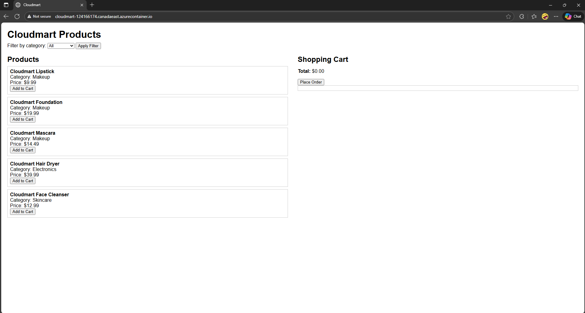

### 9.2 Filter Category

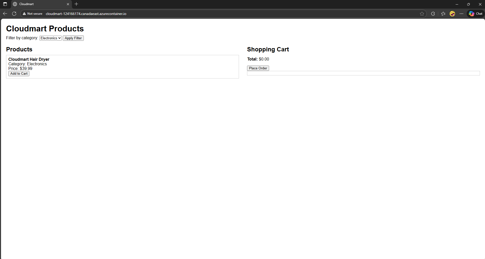

### 9.3 Shopping Cart

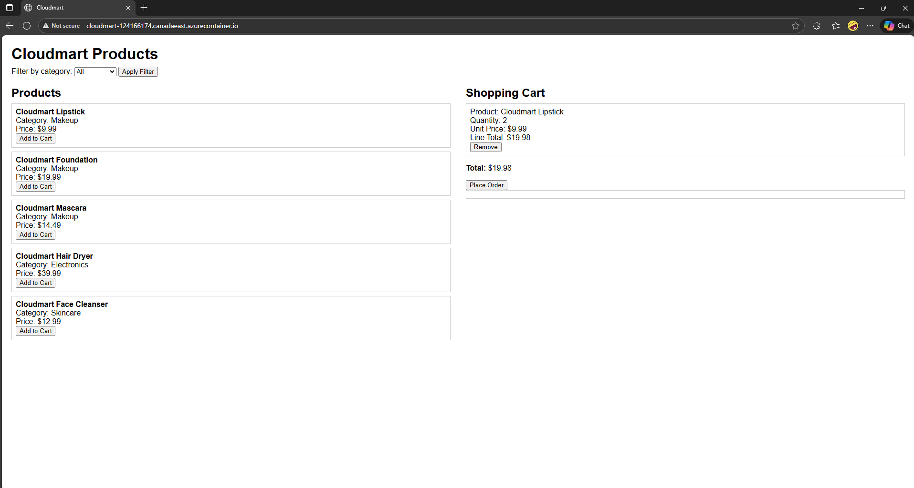

### 9.4 Order Placed


### 9.5 Health Endpoint

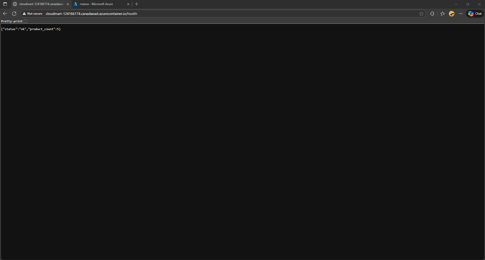

### 9.6 Cart Removal

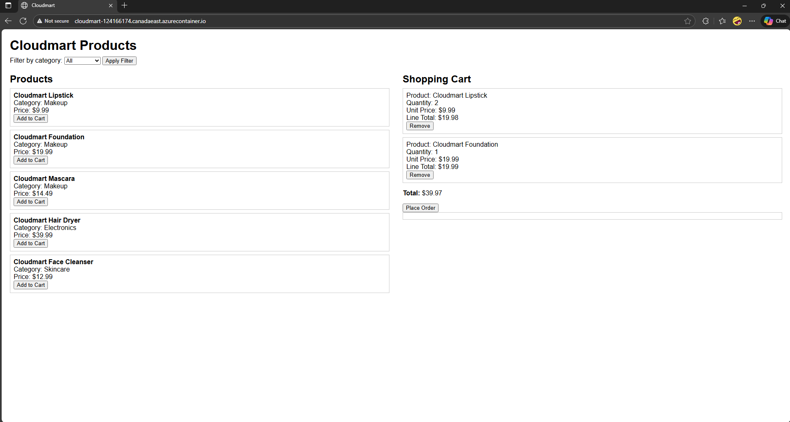


### 9.7 Order Placed


### 9.8 Proof of Order


## 10 Azure Portal Screenshots

### 10.1 Resource Group Overview

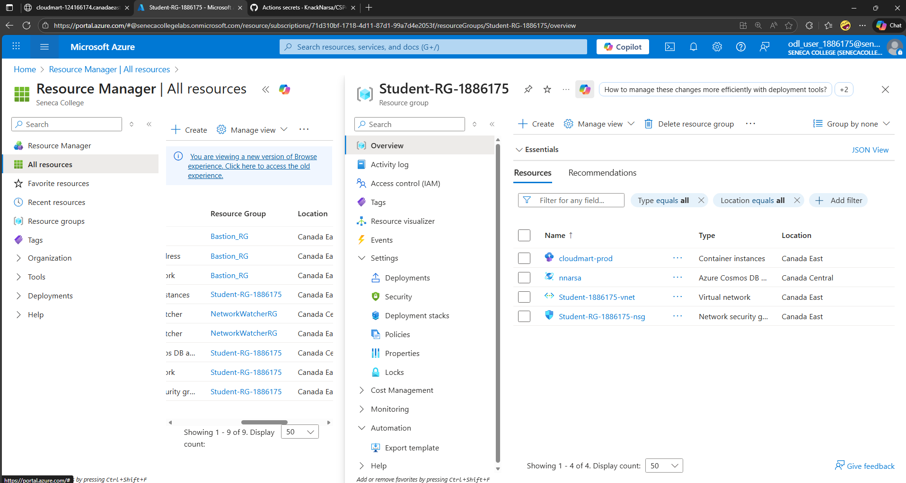

### 10.2 Container Instance Details

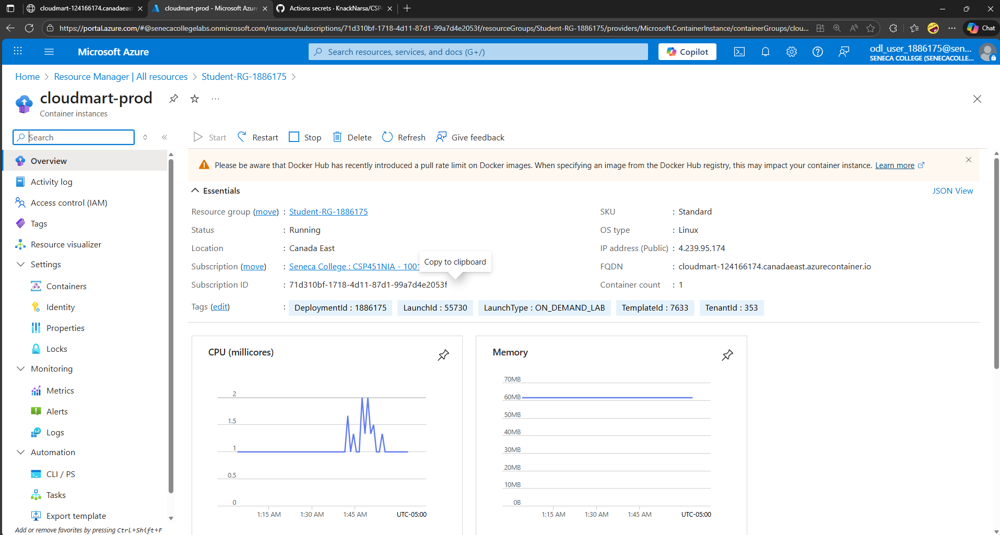

### 10.3 Cosmos DB Data Explorer

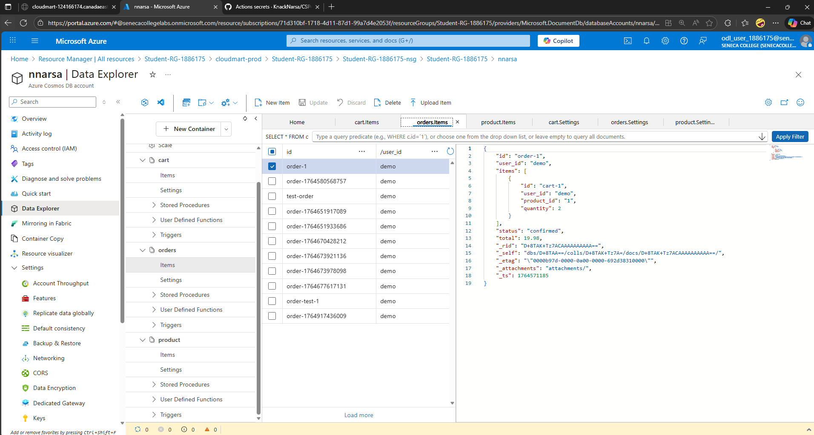

### 10.4 Network Security Group Rules

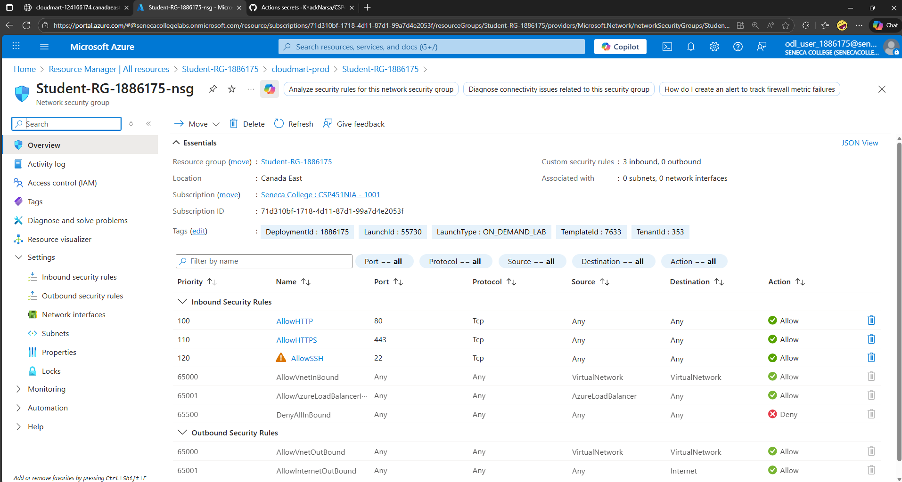

## 11 Github Screenshots

### 11.1 Actions Tab

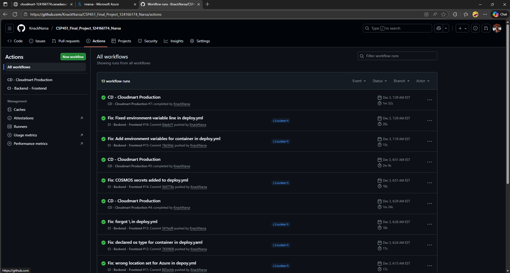

### 11.2 Secrets

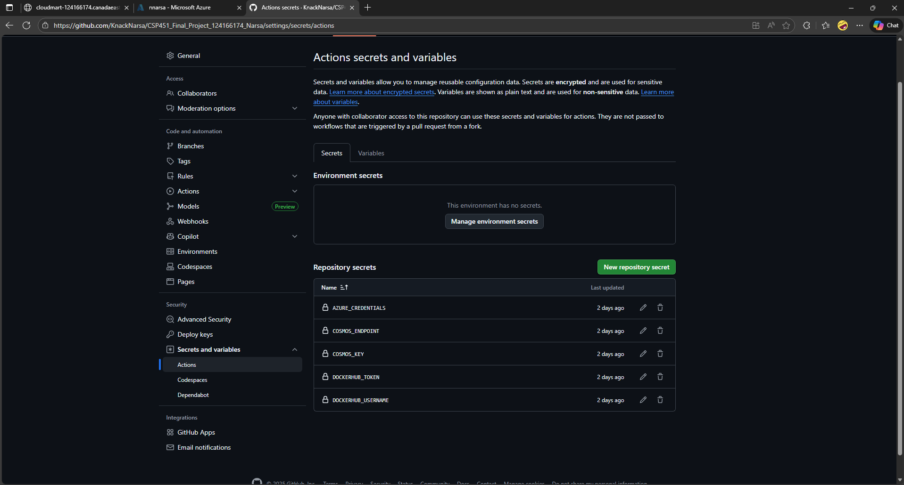

### 11.3 Repository Main Page

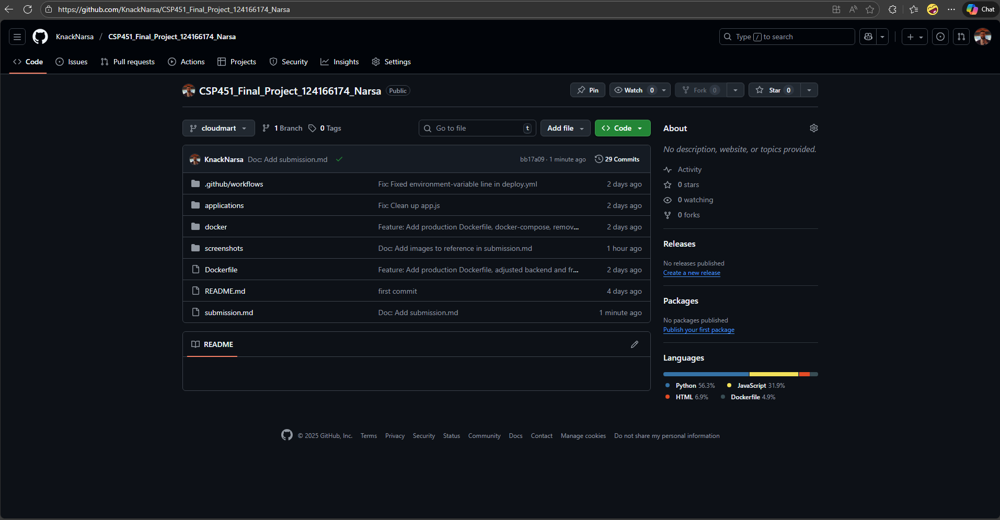

## 12 Dockerhub Screenshots

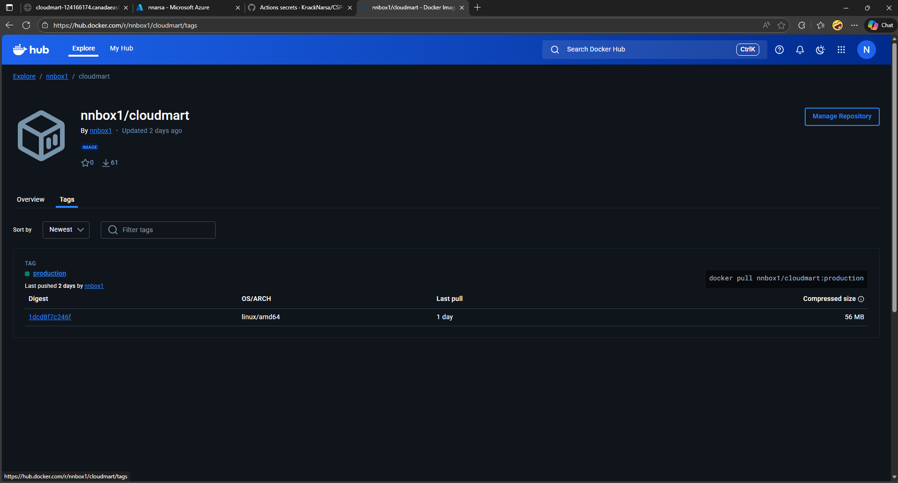

## 13 Project Summary

### Completed Components

| Component | Status | Evidence |
|-----------|--------|----------|
| Multi-tier Architecture | ✅ | Frontend + Backend API + Cosmos DB |
| Azure Container Instance | ✅ | Running at http://cloudmart-124166174.canadaeast.azurecontainer.io/|
| Azure Cosmos DB | ✅ | 3 containers (products, cart, orders) |
| Network Security Group | ✅ | HTTP, HTTPS, SSH rules configured |
| Docker Hub Integration | ✅ | dcjoker/cloudmart-api with tags |
| GitHub Actions CI | ✅ | Test backend, frontend, build images |
| GitHub Actions CD | ✅ | Push to Docker Hub, deploy to Azure |
| RESTful API | ✅ | 11 endpoints functional |
| Frontend UI | ✅ | Product catalog, cart, checkout |
| Documentation | ✅ | Complete submission.md |

| Resource | URL |
|----------|-----|
| Application | http://cloudmart-124166174.canadaeast.azurecontainer.io/ |
| Health Check | http://cloudmart-124166174.canadaeast.azurecontainer.io/health |
| Products API | http://cloudmart-124166174.canadaeast.azurecontainer.io/api/v1/products |
| GitHub Repo | https://github.com/KnackNarsa/CSP451_Final_Project_124166174_Narsa |
| GitHub Actions | https://github.com/KnackNarsa/CSP451_Final_Project_124166174_Narsa/actions |
| Docker Hub | https://hub.docker.com/r/nnbox1/cloudmart/tags |


**End of Submission Documentation**

*Submitted by: Student 1890084*  
*Course: CSP451NIA - Cloud Computing*  

*Seneca College - Fall 2025*
